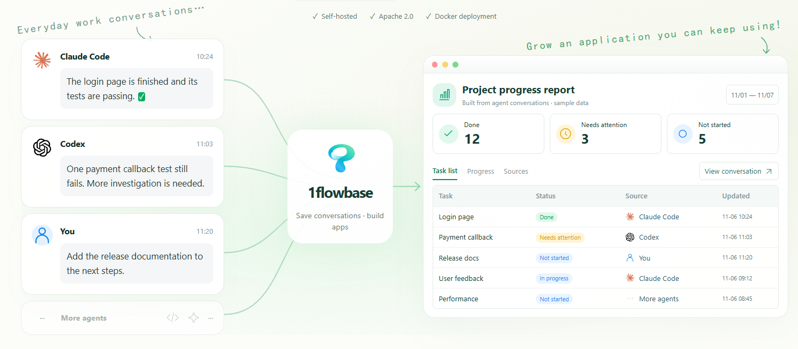
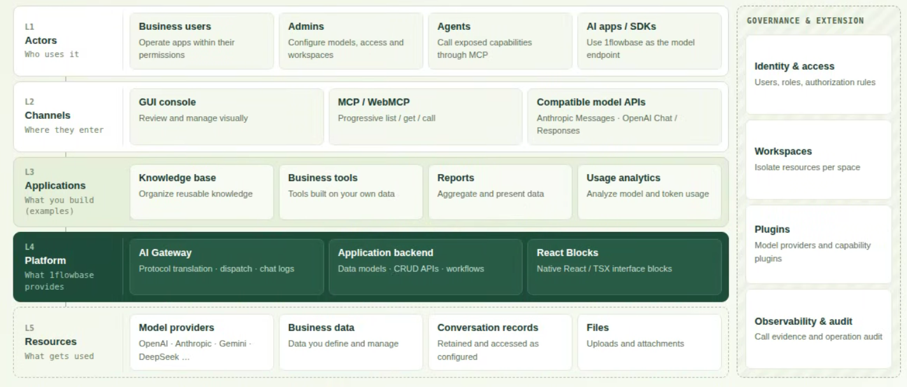
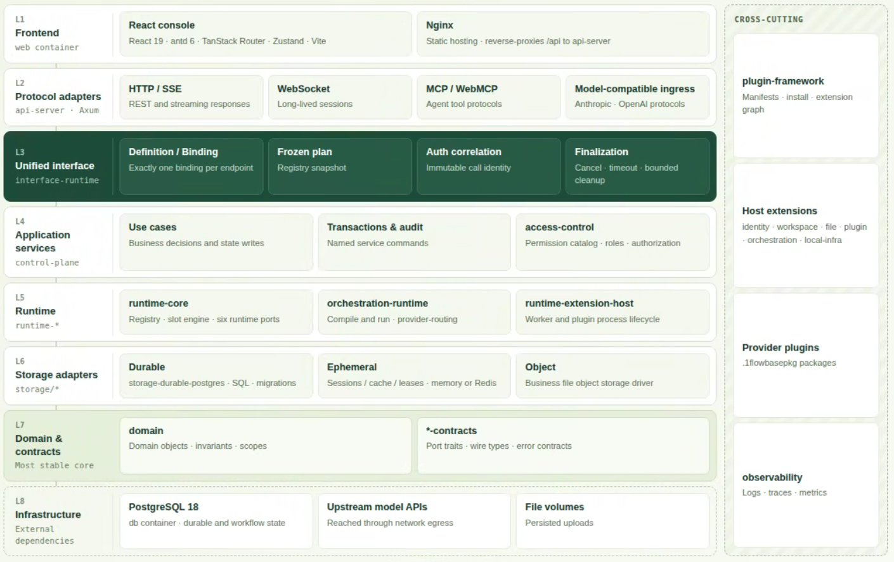

# 1flowbase

<p align="center">
  
</p>

<p align="center">
  <b>English</b> | <a href="docs/READEME-i18n/README_CN.md">简体中文</a>
</p>

<p align="center">
  <a href="https://github.com/taichuy/1flowbase/stargazers"></a>
  <a href="LICENSE"></a>
  
  
  
  
  
  
</p>

<p align="center">
  <strong>Community:</strong>
  <a href="docs/assets/community/wechat.jpg" target="_blank">WeChat</a> |
  <a href="docs/assets/community/taichuy_doc_wechat_office.png" target="_blank">WeChat Official Account</a> |
  <a href="https://x.com/Tacihu2021" target="_blank">Twitter</a>
</p>

> ## From AI Gateway to a Complete Application System.

1flowbase is a low-code native backend foundation built on an AI gateway. Beyond core AI gateway features, it lets you build your own application system on top of the AI chat data stored in the gateway.

<p align="center">
  
</p>

## An Application Foundation Designed for Agents

1flowbase is API-first by design. If a traditional GUI can take over the entire system through APIs, then turning those APIs into MCP lets an Agent take over everything as well.

<p align="center">
  
</p>

## Technical Architecture

<p align="center">
  
</p>

**1flowbase is a self-hosted AI Gateway and AI application runtime.**

Start by unifying model access, retain conversation data in the same runtime, and keep building **Workflows, APIs, business data, and React applications** on top of it. Every capability is API-based and can be exposed to Agents through MCP to understand, build, and manage.

**Dispatch intelligence, retain data, build applications.**

---

## Philosophy

- **The gateway is not the end**: Full AI conversations passing through the gateway are stored in PostgreSQL, becoming a reusable data asset for cost analysis, model quality evaluation, prompt / routing optimization, and business system development.
- **A "model" can be a Workflow**: High-capability models plan, judge, and audit; low-cost models execute. The combination is published as a single virtual model, and a model can itself be used as a Tool by another model.
- **Three protocols, one entry point**: Conversion between Anthropic Messages, OpenAI Chat Completions, and OpenAI Responses, so your application layer doesn't change when providers do.
- **Designed for Agents**: Every runtime operation available in the GUI is built on APIs, which are exposed to Agents via MCP. The MCP Gateway uses progressive `list / get / call` tool discovery instead of stuffing every Tool into the context at once.
- **Low-code efficiency + native React freedom**: Business tables can be created dynamically; UIs are written as React code blocks with access to the entire React ecosystem, not a closed drag-and-drop editor.

```text
Human → GUI ─┐
             ├→ API → AI Gateway / Workflow / Data / React UI → AI Application
Agent → MCP ─┘
```

---

## Quick Start

### Docker

Deployed with Docker — no manual environment setup required.

**Linux / macOS**

```bash
curl -fsSL https://raw.githubusercontent.com/taichuy/1flowbase/main/scripts/shell/docker-deploy.sh | sh
```

**Windows PowerShell**

```powershell
irm https://raw.githubusercontent.com/taichuy/1flowbase/main/scripts/powershell/docker-deploy.ps1 | iex
```

**Windows CMD**

```cmd
powershell -NoProfile -ExecutionPolicy Bypass -Command "irm https://raw.githubusercontent.com/taichuy/1flowbase/main/scripts/powershell/docker-deploy.ps1 | iex"
```

Follow the prompts to finish configuration and start 1flowbase. Storing full conversations can generate large data volumes; for high-traffic production, plan storage capacity, retention, backup, and compliance in advance.

### Git

**Requirements**

- Node.js `>=24.0.0`
- pnpm `11.x` (enable via `corepack enable`)
- Rust stable toolchain (Cargo)
- Docker with Docker Compose (for middleware such as PostgreSQL)

**Start**

Run from the repository root:

```bash
git clone https://github.com/taichuy/1flowbase.git
cd 1flowbase
node scripts/node/dev-up.js
```

`dev-up` starts the Docker middleware, installs frontend dependencies, builds and runs the backend, and starts the frontend. Other common commands:

```bash
node scripts/node/dev-up.js status
node scripts/node/dev-up.js stop
node scripts/node/dev-up.js restart --frontend-only
node scripts/node/dev-up.js restart --backend-only
```

Logs are written to `tmp/logs/`. For more scripts, see [scripts/README.md](scripts/README.md).

---

## Comparison

| Project    | AI Gateway | Composite Models / Workflow | Full Conversation Data | Dynamic Business Data | MCP          | React Apps       |
| ---------- | ---------- | --------------------------- | ---------------------- | --------------------- | ------------ | ---------------- |
| 1flowbase  | ✅          | ✅                           | ✅                      | ✅                     | ✅            | ✅                |
| LiteLLM    | ✅          | —                           | Partial                | —                     | —            | —                |
| OpenRouter | ✅          | —                           | Platform-hosted        | —                     | —            | —                |
| Dify       | Partial    | ✅                           | ✅                      | —                     | ✅            | Fixed app types  |
| Supabase   | —          | —                           | —                      | ✅                     | Ecosystem    | Build your own   |
| n8n        | —          | ✅                           | —                      | —                     | Ecosystem    | —                |

---

## Roadmap

- Out-of-the-box application templates (AI Gateway, multi-model router, enterprise AI Gateway, AI education platform, Agent application backend)
- Better official MCP Tool descriptions so Coding Agents like Codex can build applications without reading the source code
- Lifecycle management for AI conversation data

---

## Tutorials

- [Make GLM-5.2 See Images in Claude Code with 1flowbase](https://github.com/taichuy/1flowbase/wiki/Make-GLM-5.2-See-Images-in-Claude-Code-with-1flowbase-CN)
- [Fusion-Style Workflow: Publish a Multi-Model Review Panel as an Observable Virtual Model](https://github.com/taichuy/1flowbase/wiki/Fusion-Style-Workflow-CN)
- [1flowbase Wiki](https://github.com/taichuy/1flowbase/wiki)

---

## Repository Layout

```text
web/          Frontend root, powered by pnpm + Turbo
api/          Rust backend workspace
api/apps/     Backend service entry points
api/crates/   Shared backend crates
api/plugins/  Plugin source workspace, HostExtension manifests and templates
docker/       Local middleware orchestration and self-hosted service stack
scripts/      Repository-level development, testing, verification, and debugging scripts
```

---

## Contributing

Community contributions are very welcome. Before submitting a Pull Request, please run the following verification script:

```bash
node scripts/node/verify.js repo
```

Development guidelines:

- [AGENTS.md](../../AGENTS.md)
- [web/AGENTS.md](../../web/AGENTS.md)
- [api/AGENTS.md](../../api/AGENTS.md)

---

## Friends

- [Linux.do](https://linux.do/) - Learn AI, on L Station.
- [Aionui](https://github.com/iOfficeAI/AionUi) - Remotely control AI from your phone.
- [OfficeCLI](https://github.com/iOfficeAI/OfficeCLI) - Office suite designed for AI Agents.
- [deepseek-pp](https://github.com/zhu1090093659/deepseek-pp) - DeepSeek web chat browser extension.
- [MuseAI](https://github.com/yejiming/MuseAI) - Local AI companion, text adventure, and interactive fiction app.
- [FrontAgent](https://github.com/FrontAgent/FrontAgent) - AI Agent system designed for frontend engineering.
- [RedBox](https://github.com/Jamailar/RedBox) - Localized AI creation workspace for Xiaohongshu creators.

---

## License

This project is licensed under [Apache-2.0](./LICENSE).

---

## Contributors

<p align="center">
  <a href="https://github.com/taichuy/1flowbase/graphs/contributors">
    
  </a>
</p>

---

## Star History

<a href="https://www.star-history.com/?type=date&repos=taichuy%2F1flowbase">
 <picture>
   <source media="(prefers-color-scheme: dark)" srcset="https://api.star-history.com/chart?repos=taichuy/1flowbase&type=date&theme=dark&legend=top-left&sealed_token=FqLzVSU8-9DxFglG-qgV59WwozJJfOHYwvjWNeVtnDP8OJ8r8BwvdLCIloKkdrLXWJqUEaD9xkVSr0RkCvzGaIxDYXYX2Zz53ikx7xZkZckNqgevZkOi1A" />
   <source media="(prefers-color-scheme: light)" srcset="https://api.star-history.com/chart?repos=taichuy/1flowbase&type=date&legend=top-left&sealed_token=FqLzVSU8-9DxFglG-qgV59WwozJJfOHYwvjWNeVtnDP8OJ8r8BwvdLCIloKkdrLXWJqUEaD9xkVSr0RkCvzGaIxDYXYX2Zz53ikx7xZkZckNqgevZkOi1A" />
   
 </picture>
</a>

---

<div align="center">

**If you want Agents to build and operate self-hosted applications across AI, MCP, application backends, and React interfaces — give 1flowbase a Star.**

[Report a Bug](https://github.com/taichuy/1flowbase/issues) · [Request a Feature](https://github.com/taichuy/1flowbase/issues)

</div>