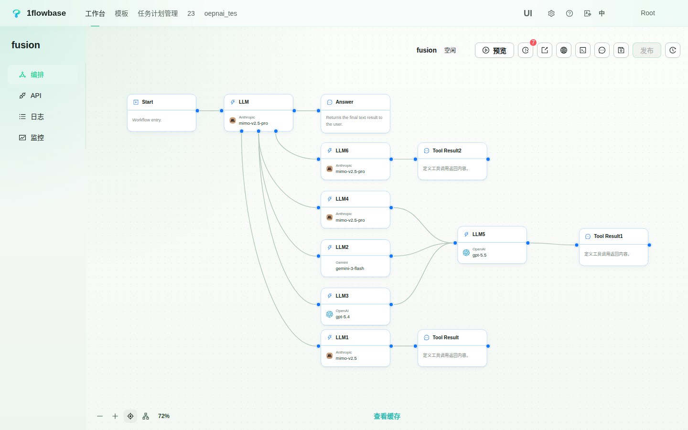
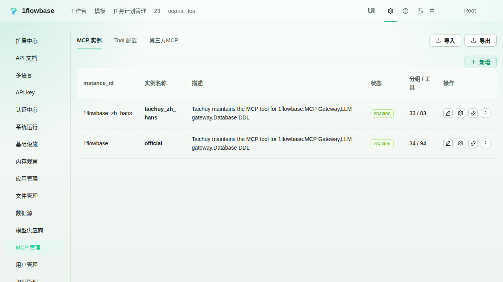
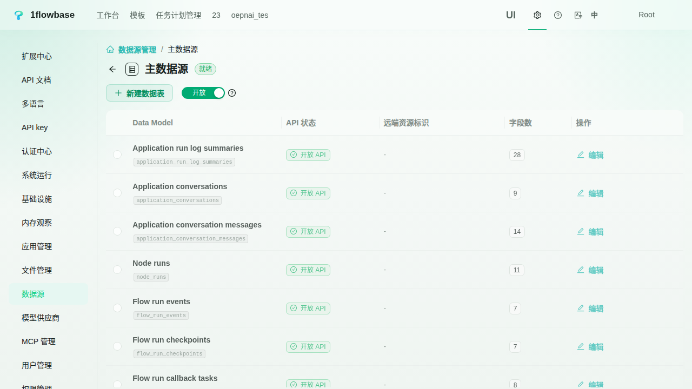
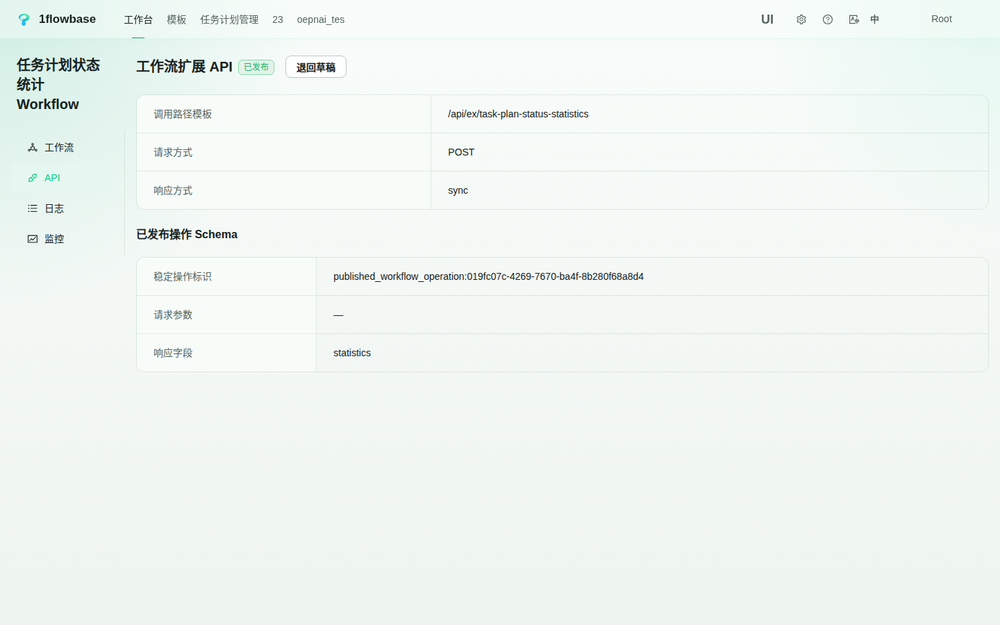
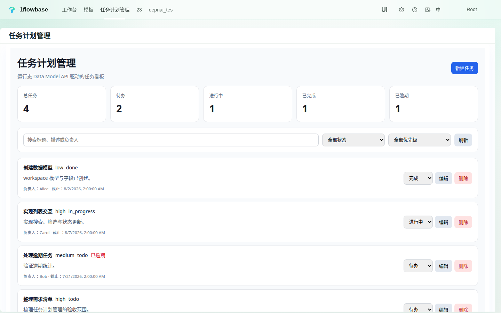
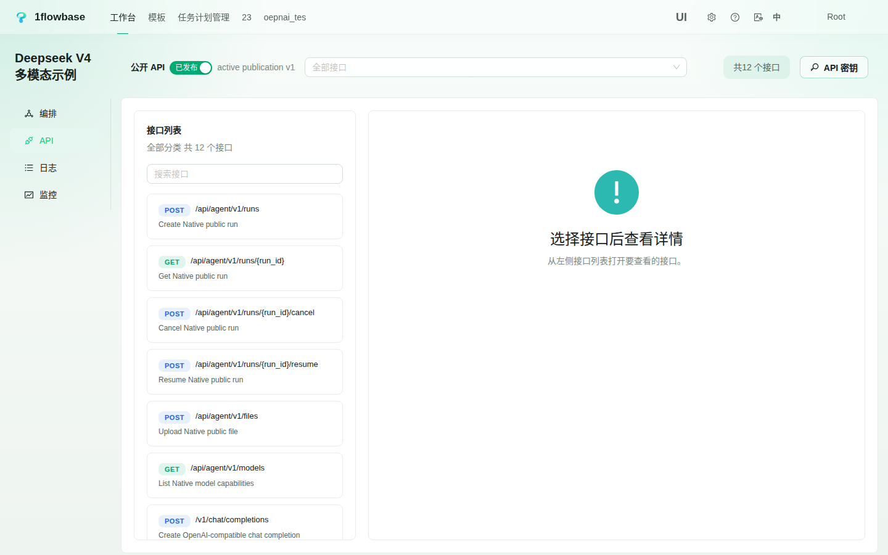

# 1flowbase

<p align="center">
  
</p>

<p align="center">
  <a href="../../README.md">English</a> | <b>简体中文</b>
</p>

<p align="center">
  <a href="https://github.com/taichuy/1flowbase/stargazers"></a>
  <a href="../../LICENSE"></a>
  
  
  
  
  
  
</p>

<p align="center">
  <strong>交流与社区：</strong>
  <a href="../assets/community/wechat.jpg" target="_blank">微信</a> |
  <a href="../assets/community/taichuy_doc_wechat_office.png" target="_blank">微信公众号（文档）</a> |
  <a href="https://x.com/Tacihu2021" target="_blank">Twitter</a>
</p>

> **基于四大开源基座构建完整的 Agent-Native 应用：AI Gateway、MCP Gateway、内置应用后端与 Native React 前端区块。**

1flowbase 让本地 Agent、模型客户端、外部系统和人通过相互独立的入口使用同一个自托管应用平台。本地 Agent 可以只连接 MCP Gateway，继续使用自己已有的模型配置来搭建和操作应用；是否再连接 AI Gateway 是可选项，连接后可以获得兼容模型接口、多模型工作流与详细执行 Trace。

```text
本地 Agent -> MCP Gateway -> 发现 / 配置 / 搭建 / 操作
模型客户端 -> AI Gateway -> 兼容接口 / 模型工作流 / Trace
外部系统   -> 应用后端   -> 自动 CRUD API / 自定义工作流 API
人         -> React 区块 -> 交互式应用界面

四大基座可以独立使用，也可以围绕同一个 1flowbase 应用组合。
```

| 基座 | 提供的能力 |
|---|---|
| **AI Gateway** | 转换和分发 OpenAI Responses、Chat Completions 与 Claude Messages 流量；路由模型，并把可观测工作流发布为虚拟模型 |
| **MCP Gateway** | 把 1flowbase 能力投影为可渐进发现的工具；管理 Tool、mapping、Group、Binding、策略、上游 MCP 连接与可复用 Bundle |
| **应用后端 / Application Backend** | 定义 Data Model 并物化 PostgreSQL 表、字段、索引和关系；自动生成受治理的 CRUD API，并发布由 Workflow 驱动的自定义接口 |
| **Native React 前端区块** | 使用标准 React/TSX 与 CSS、受控组件导入、数据绑定和 Shadow DOM 隔离构建响应式应用界面 |

例如，本地 Agent 可以通过 MCP 创建 `Customer` 与 `Ticket` Data Model，搭建由 Workflow 支撑的 `/api/ex/tickets/escalate` 接口，并构建 React 界面。外部系统调用自动生成的后端 API，人直接在界面中工作。如果同一个本地 Agent 还把模型端点指向 AI Gateway，就能获得带路由、模型组合和完整日志的虚拟模型；应用本身不依赖这个可选连接。



---

## 现在可以构建什么

### 让 Agent 搭建和操作 1flowbase 应用

MCP Gateway 把平台能力投影为面向 Agent 的虚拟 UI。Agent 可以渐进发现相关领域、读取 Tool 契约、发起调用、验证结果状态并继续搭建，不需要为每个任务新增一条硬编码前端流程。

```text
Agent
  -> mcp_list：发现应用与能力
  -> mcp_get：读取下一步 Tool 契约
  -> mcp_call：创建、配置、运行与发布
  -> 检查状态 / Trace
  -> 继续迭代
```

### 创建开箱即用的应用后端

在 1flowbase 中定义并发布 Data Model，平台会物化 PostgreSQL Schema，并生成理解数据模型的 List、Get、Create、Update、Delete API 与 OpenAPI 契约。当标准 CRUD 不够时，可以使用 Workflow Extension 定义业务逻辑，并发布为 `/api/ex/{slug}` 自定义接口。

```text
Data Model 定义
  -> PostgreSQL 表 / 字段 / 索引 / 关系
  -> 自动 CRUD 运行时 API + OpenAPI

Workflow
  -> 自定义输入输出契约
  -> 发布 /api/ex/{slug} 接口
```

### 使用 Native React 区块构建人机交互界面

前端区块直接使用标准 React/TSX、Hooks、事件和 CSS。1flowbase 在隔离的 Shadow DOM 运行时中编译和挂载区块，并通过受控目录与上下文契约暴露区块获准使用的平台能力。

```tsx
export default function StatusCard({ ctx }) {
  const status = ctx.inputs.status;
  return <button onClick={() => ctx.outputs.publish({ action: 'retry' })}>
    {status}
  </button>;
}
```

### 给文本优先 Coding Model 增加视觉能力

让 GLM-5.2、DeepSeek 或其他强文本 Coding Model 继续负责规划和写代码，由 1flowbase 把截图、UI 图片、图表和 PDF 页面路由给挂载的视觉模型。

```text
Claude Code
  -> 1flowbase 虚拟模型接口
  -> GLM-5.2 / DeepSeek / 其他主力 Coding Model
  -> 挂载的视觉工具
  -> GLM-5V-Turbo / Gemini / GPT vision / OCR 模型
  -> 结构化视觉结果
  -> 最终代码回答
```

教程：[让 GLM-5.2 在 Claude Code 里看图](https://github.com/taichuy/1flowbase/wiki/Make-GLM-5.2-See-Images-in-Claude-Code-with-1flowbase-CN)

### 发布 Fusion 风格多模型评审器

1flowbase 内置 `fusion` 模板。客户端只调用一个模型名；1flowbase 在后台询问多个分支模型，调用汇总模型，返回最终回答，并保留每个分支的执行记录。

```text
用户请求
  -> 主 LLM
  -> fusion 工具
     -> 分支 LLM A
     -> 分支 LLM B
     -> 分支 LLM C
     -> 汇总 LLM
  -> 最终回答
```

教程：[Fusion 风格工作流：把多模型评审团发布成一个可观测的虚拟模型](https://github.com/taichuy/1flowbase/wiki/Fusion-Style-Workflow-CN)

### 发布由工作流支撑的模型 API

构建一次工作流，即可通过常见模型协议对外提供服务：

| 协议 | API 路径 | 典型用途 |
|---|---:|---|
| OpenAI Responses API | `/v1/responses` | 新版 OpenAI 风格客户端与应用代码 |
| OpenAI Chat Completions API | `/v1/chat/completions` | SDK、编程工具、聊天客户端、应用开发框架 |
| Claude 兼容 Messages API | `/v1/messages` | 支持自定义接口的 Claude 兼容客户端 |

---

## 安装或升级

Linux/macOS：

```bash
curl -fsSL https://raw.githubusercontent.com/taichuy/1flowbase/main/scripts/shell/docker-deploy.sh | sh
```

Windows PowerShell：

```powershell
irm https://raw.githubusercontent.com/taichuy/1flowbase/main/scripts/powershell/docker-deploy.ps1 | iex
```

Windows CMD：

```cmd
powershell -NoProfile -ExecutionPolicy Bypass -Command "irm https://raw.githubusercontent.com/taichuy/1flowbase/main/scripts/powershell/docker-deploy.ps1 | iex"
```

---

## 从源码运行

这个路径适合开发 1flowbase 本身。

运行环境要求：Node.js `>= 24.0.0`、pnpm、最新稳定版 Rust，以及用于本地中间件的 Docker。

```bash
git clone https://github.com/taichuy/1flowbase.git
cd 1flowbase

docker compose -f docker/docker-compose.middleware.yaml up -d

cd web
pnpm install
pnpm dev
```

前端地址：

```text
http://127.0.0.1:3100
```

启动后端服务：

```bash
cd api
# 首次运行前请确保将 api/apps/api-server/.env.example 复制并保存为 .env。
cargo run -p api-server --bin api-server
cargo run -p plugin-runner --bin plugin-runner
```

默认后端服务地址：

```text
API 服务：http://127.0.0.1:7800
插件运行器：http://127.0.0.1:7801
```

使用脚本辅助启动：

```bash
node scripts/node/dev-up.js
node scripts/node/dev-up.js status
node scripts/node/dev-up.js stop
node scripts/node/dev-up.js restart
```

更多配置项请参考 [scripts/README.md](../../scripts/README.md)。

---

## 1flowbase 适合放在哪里

1flowbase 不只是模型代理、MCP Server 集合或又一个聊天界面。

| 工具类别 | 常见功能与定位 | 1flowbase 的不同之处 |
|---|---|---|
| LLM 网关 / 模型路由器 | 将外部模型流量路由到不同供应商 | 对外提供 OpenAI / Anthropic 兼容接口，并在背后组合模型、工作流与详细执行记录 |
| MCP Server / Gateway | 向 Agent 暴露或聚合工具 | 暴露 1flowbase 应用控制面，同时连接并治理上游 MCP 工具 |
| Backend-as-a-Service / 后端构建器 | 提供数据表和通用 CRUD 接口 | 物化受治理的 PostgreSQL Data Model，并把自动 CRUD 与 Workflow 自定义 API 组合在同一平台 |
| AI 工作流构建器 | 构建 AI 应用或流程工作流 | 通过模型 API 暴露工作流，并让 Agent 通过 MCP 操作外围应用 |
| Agent 应用框架 | 帮助开发者编写 Agent 图与交互界面 | 组合可视化运行时、Agent 控制面、协议发布和 Native React 应用界面 |
| 可观测性 / 成本追踪工具 | 统计 Token 消耗量或账单总额 | 将成本精确关联至工作流节点、模型调用、工具回调和 Trace |

```text
模型服务平面：AI Gateway（供外部客户端按需使用）
Agent 控制平面：MCP Gateway
数据与 API 平面：应用后端
人机体验平面：Native React 前端区块

1flowbase 在一个自托管平台中提供四大基座。
```

---

## 功能预览

### 1. MCP Gateway：把应用控制面交给 Agent

本地或外部 Agent 可以通过 MCP 连接 1flowbase，并使用 `mcp_list`、`mcp_get`、`mcp_call` 渐进发现和操作应用、工作流、Data Model、前端以及 MCP 管理能力。

MCP 连接可以独立工作。Agent **不需要**把自己的模型流量接入 AI Gateway。



### 2. 应用后端：完成数据建模并直接获得可用 API

直接在 1flowbase 中创建 Data Model。后端会物化 PostgreSQL 表、字段、索引和关系，并提供受治理的 CRUD 运行时 API 与 OpenAPI 契约。



当自动 CRUD 不足以承载业务逻辑时，可以把工作流发布为 `/api/ex/{slug}` 下的同步或异步扩展接口。



### 3. Native React 区块：构建面向用户的应用界面

使用原生 React/TSX 区块构建交互页面。区块可以使用 Hooks、CSS、事件、响应式上下文、受控组件以及 Data Model / API 数据绑定，并在隔离的前端运行时中执行。



### 4. AI Gateway：向外部客户端提供组合后的模型能力

把 Agent Flow 发布为原生、OpenAI 兼容或 Anthropic 兼容 API。外部客户端可以按需接入 AI Gateway，获得协议转换、模型组合、API 凭据以及详细的请求与执行记录。



一个对外模型接口背后，可以通过可视化运行时跨供应商分支调用模型、使用工具、校验结果并汇总最终响应。


---

## 典型应用场景

### 让 Agent 搭建并持续管理内部应用

```text
本地或外部 Agent
  -> MCP Gateway
  -> 创建 Data Model 与关系
  -> 发布 CRUD 与 Workflow Extension API
  -> 组装 Native React 区块
  -> 检查并持续演化运行中的应用
```

这是四大基座组成的主要全栈路径：Agent 通过 MCP 操作控制面，应用后端负责数据和 API，Native React 区块提供人机界面。只有当应用还需要对外提供受治理的模型服务时，才按需接入 AI Gateway。

### 无需单独组装后端技术栈即可交付应用后端

```text
Data Model
  -> PostgreSQL 表 / 字段 / 索引 / 关系
  -> 自动 CRUD 运行时与 OpenAPI
  -> 使用 Workflow Extension API 承载自定义业务逻辑
```

适用于内部工具、管理系统、运营看板、Agent 记忆存储、内容系统和中小型产品后端。

### 给 Agent 管理的数据增加定制化人机界面

```text
Data Model / 自定义 API
  -> Native React 区块
  -> 搜索、筛选、表单、操作与响应式布局
```

上面的任务计划看板就是真实案例：原生 React 界面直接通过 Data Model API 读取和更新记录，不需要再搭建一套独立的前端后端。

### 为 AI 客户端发布可编程的上游模型

```text
外部 AI 客户端
  -> 可选的 AI Gateway
  -> 协议转换
  -> 模型与工具工作流
  -> 日志、Trace、Token 用量与最终响应
```

客户端只调用一个模型名，1flowbase 可以在背后运行跨供应商工作流。适用于多模态增强、Fusion 风格评审、模型级联、结构化输出校验和可编程 Coding Model 流程。

---

## 当前状态

### 已实现

- [x] 可视化工作流编辑器
- [x] 多节点工作流编排
- [x] 虚拟模型接口发布
- [x] 支持 OpenAI Responses 协议
- [x] 支持 OpenAI Chat Completions 协议
- [x] 支持 Claude 兼容 Messages 协议
- [x] 支持流式响应
- [x] 面向多模态和分支模型工作流的挂载 LLM 工具
- [x] `fusion` 工作流模板
- [x] 执行日志
- [x] 1flowbase 工作流内部的工具回调 Trace
- [x] 应用级 Token 消耗统计
- [x] Prompt 与模型配置版本历史管理
- [x] 支持渐进式 `mcp_list`、`mcp_get` 与 `mcp_call` 发现的 MCP Gateway
- [x] MCP Tool、mapping、Group、Binding、发现策略与上游连接管理
- [x] 可复用 MCP Bundle 导入、导出、校验与本地 Library 流程
- [x] 动态 Data Model 物化 PostgreSQL 表、字段、索引和关系
- [x] 自动生成 Data Model CRUD 运行时 API 与 OpenAPI 契约
- [x] 在 `/api/ex/{slug}` 下发布自定义 Workflow Extension API
- [x] 支持 Hooks、CSS、事件和 Shadow DOM 隔离的 Native React/TSX 前端区块
- [x] 受控前端组件目录、代码 Studio、响应式上下文与数据绑定

### 持续增强中

- [ ] 更深度的本地 Agent 对话收集
- [ ] 会话搜索与回放
- [ ] Token 物料清单：按 Prompt、历史上下文、工具定义、命令输出、媒体输入和节点拆解用量
- [ ] 异常成本检测与优化建议
- [ ] 会话导出和 Recall Pack 生成
- [ ] 更多 Claude Code / Codex / OpenCode / Cline / Continue 模板
- [ ] 覆盖更多产品领域的 Agent-Ready MCP Virtual UI
- [ ] 组合 MCP 管理、应用后端、前端区块与可选 AI Gateway 服务的更多端到端应用 Recipe

### 长期规划中

- [ ] 在四大应用基座之上扩展更完整的低代码创作能力
- [ ] 团队协作空间与多租户管理
- [ ] 权限、审批、审计与成本治理机制
- [ ] 适配更多本地 AI Agent 客户端
- [ ] 模板市场与工作流 Recipes 生态

> 四大基座目前都已实现并可用，但它们是可组合能力，不是强制串行阶段：外部 Agent 可以只使用 MCP Gateway，而不把模型流量接入 AI Gateway。更完整的低代码创作、团队治理和模板生态仍在持续演进。

---

## 透明性与安全

1flowbase 致力于提供透明、自托管的 AI 工作流运行环境。

推荐原则：

- 自托管优先
- 透明的模型链条
- 可审计的节点调用
- 可追踪的 Token 消耗
- 可配置的日志保留周期
- 敏感数据脱敏过滤
- 显式的模型与工作流配置

1flowbase 不提倡在用户不知情的情况下隐式替换模型。发布的每一个接口都应当由项目所有者清晰配置、观测和治理。

---

## 使用教程

- [让 GLM-5.2 在 Claude Code 里看图](https://github.com/taichuy/1flowbase/wiki/Make-GLM-5.2-See-Images-in-Claude-Code-with-1flowbase-CN)
- [Fusion 风格工作流：把多模型评审团发布成一个可观测的虚拟模型](https://github.com/taichuy/1flowbase/wiki/Fusion-Style-Workflow-CN)
- [1flowbase Wiki](https://github.com/taichuy/1flowbase/wiki)

---

## 仓库目录布局

```text
web/          前端根目录，基于 pnpm + Turbo 运作
api/          Rust 后端 Workspace 工作区
api/apps/     后端服务入口
api/crates/   共享后端 Crate 包
api/plugins/  插件源码工作区、HostExtension 清单与模板
docker/       本地中间件编排与自托管服务栈
scripts/      仓库级开发、测试、验证与调试脚本
```

---

## 参与贡献

非常欢迎社区贡献。在提交 Pull Request 之前，请运行以下验证脚本：

```bash
node scripts/node/verify.js repo
```

项目开发指导准则：

- [AGENTS.md](../../AGENTS.md)
- [web/AGENTS.md](../../web/AGENTS.md)
- [api/AGENTS.md](../../api/AGENTS.md)

---

## 友情链接

- [Linux.do](https://linux.do/) - 学 AI，上 L 站。
- [Aionui](https://github.com/iOfficeAI/AionUi) - 手机远程控制 AI 干活。
- [OfficeCLI](https://github.com/iOfficeAI/OfficeCLI) - 专为 AI 智能体设计的 Office 套件。
- [deepseek-pp](https://github.com/zhu1090093659/deepseek-pp) - DeepSeek 网页对话浏览器扩展插件。
- [MuseAI](https://github.com/yejiming/MuseAI) - 本地 AI 伴侣、文字冒险与穿书互动应用。
- [FrontAgent](https://github.com/FrontAgent/FrontAgent) - 专为前端工程设计的 AI Agent 系统。
- [RedBox](https://github.com/Jamailar/RedBox) - 面向小红书创作者的本地化 AI 创作工作台。

---

## 协议

本项目基于 [Apache-2.0](../../LICENSE) 开源协议授权。

---

## 贡献者

<p align="center">
  <a href="https://github.com/taichuy/1flowbase/graphs/contributors">
    
  </a>
</p>

---

## Star 增长历史

<a href="https://www.star-history.com/?type=date&repos=taichuy%2F1flowbase">
 <picture>
   <source media="(prefers-color-scheme: dark)" srcset="https://api.star-history.com/chart?repos=taichuy/1flowbase&type=date&theme=dark&legend=top-left&sealed_token=FqLzVSU8-9DxFglG-qgV59WwozJJfOHYwvjWNeVtnDP8OJ8r8BwvdLCIloKkdrLXWJqUEaD9xkVSr0RkCvzGaIxDYXYX2Zz53ikx7xZkZckNqgevZkOi1A" />
   <source media="(prefers-color-scheme: light)" srcset="https://api.star-history.com/chart?repos=taichuy/1flowbase&type=date&legend=top-left&sealed_token=FqLzVSU8-9DxFglG-qgV59WwozJJfOHYwvjWNeVtnDP8OJ8r8BwvdLCIloKkdrLXWJqUEaD9xkVSr0RkCvzGaIxDYXYX2Zz53ikx7xZkZckNqgevZkOi1A" />
   
 </picture>
</a>

---

<div align="center">

**如果你希望 Agent 跨 AI、MCP、应用后端与 React 界面搭建并运营自托管应用，欢迎给 1flowbase 点一个 Star。**

[报告 Bug](https://github.com/taichuy/1flowbase/issues) · [提出新需求](https://github.com/taichuy/1flowbase/issues)

</div>
