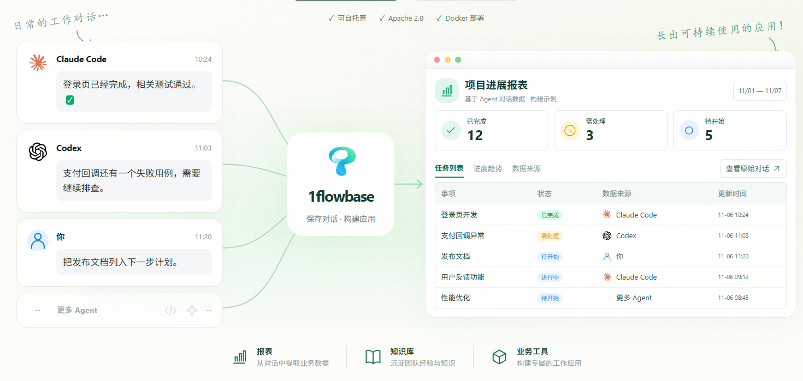
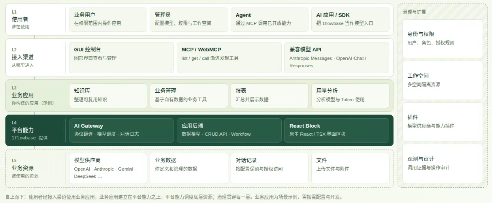
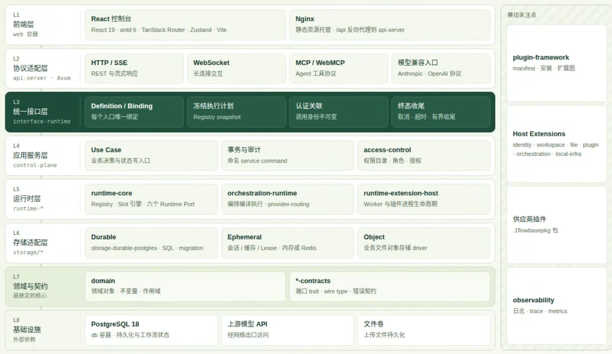

# 1flowbase

<p align="center">
  
</p>

<p align="center">
  <a href="../../README.md">English</a> | <b>简体中文</b>
</p>

<p align="center">
  <a href="https://github.com/taichuy/1flowbase/stargazers"></a>
  <a href="../../LICENSE"></a>
  
  
  
  
  
  
</p>

<p align="center">
  <strong>交流与社区：</strong>
  <a href="../assets/community/wechat.jpg" target="_blank">微信</a> |
  <a href="../assets/community/taichuy_doc_wechat_office.png" target="_blank">微信公众号（文档）</a> |
  <a href="https://x.com/Tacihu2021" target="_blank">Twitter</a>
</p>

> ## 从 AI Gateway 到完整应用系统。

1flowbase是在AI gateway的低代码原生后端基座，除了AI网关基础功能之外，我们还支持你利用网关中存储AI聊天记录搭建你们独属于你们应用系统。

<p align="center">
  
</p>


## 为agent而设计应用底座

1flowbase设计之初就以API 接口为第一优先级看，我们认为传统GUI可以通过操作接口接管系统一切，那么将接口转化为MCP也可以交给agent接管一切

<p align="center">
  
</p>

## 技术架构：

<p align="center">
  
</p>


**1flowbase 是一个可自托管的 AI Gateway 与 AI 应用运行时。**

从统一接入模型开始，在同一个运行时里沉淀会话数据，并继续构建 **Workflow、API、业务数据与 React 应用**。所有能力以 API 为基础，并可通过 MCP 交给 Agent 理解、构建和管理。

**分发智能，沉淀数据，构建应用。**

---

## 项目理念

- **Gateway 不是终点**：经过网关的完整 AI 会话保存到 PostgreSQL，成为可分析、可复用的数据资产，用于成本分析、模型质量评估、Prompt / 路由优化和业务系统建设。
- **一个“模型”可以是一条 Workflow**：高能力模型负责规划、判断与审计，低成本模型负责执行，组合后作为虚拟模型统一发布；模型本身也可以作为另一个模型的 Tool。
- **三种协议，一个入口**：支持 Anthropic Messages、OpenAI Chat Completions、OpenAI Responses 之间的转换，应用层不随供应商变化而改动。
- **为 Agent 而设计**：GUI 能做的运行时操作都建立在 API 之上，API 再通过 MCP 暴露给 Agent。MCP Gateway 采用 `list / get / call` 渐进式工具发现，避免把大量 Tool 一次性塞进上下文。
- **低代码效率 + 原生 React 自由度**：业务数据表可动态创建；UI 使用 React 代码区块编写，可直接使用整个 React 生态，而不是封闭的拖拽编辑器。

```text
Human → GUI ─┐
             ├→ API → AI Gateway / Workflow / Data / React UI → AI Application
Agent → MCP ─┘
```

---

## 快速开始

### Docker 部署

基于 Docker 部署，无需手动搭建运行环境。

**Linux / macOS**

```bash
curl -fsSL https://raw.githubusercontent.com/taichuy/1flowbase/main/scripts/shell/docker-deploy.sh | sh
```

**Windows PowerShell**

```powershell
irm https://raw.githubusercontent.com/taichuy/1flowbase/main/scripts/powershell/docker-deploy.ps1 | iex
```

**Windows CMD**

```cmd
powershell -NoProfile -ExecutionPolicy Bypass -Command "irm https://raw.githubusercontent.com/taichuy/1flowbase/main/scripts/powershell/docker-deploy.ps1 | iex"
```

按提示完成配置即可启动。完整保存会话会产生较大数据量，高流量生产环境请提前评估存储容量、保留周期、备份与合规策略。

### Git 源码启动

**环境要求**

- Node.js `>=24.0.0`
- pnpm `11.x`（可通过 `corepack enable` 启用）
- Rust stable 工具链（Cargo）
- Docker 与 Docker Compose（用于 PostgreSQL 等中间件）

**启动**

在仓库根目录执行：

```bash
git clone https://github.com/taichuy/1flowbase.git
cd 1flowbase
node scripts/node/dev-up.js
```

`dev-up` 会启动 Docker 中间件、安装前端依赖、构建并运行后端，再启动前端。其他常用命令：

```bash
node scripts/node/dev-up.js status
node scripts/node/dev-up.js stop
node scripts/node/dev-up.js restart --frontend-only
node scripts/node/dev-up.js restart --backend-only
```

日志写入 `tmp/logs/`。更多常用脚本见 [scripts/README.md](../../scripts/README.md)。

---

## 与其他工具对比

| 项目       | AI Gateway | 组合模型 / Workflow | 完整会话数据 | 动态业务数据 | MCP      | React 应用   |
| ---------- | ---------- | ------------------- | ------------ | ------------ | -------- | ------------ |
| 1flowbase  | ✅          | ✅                   | ✅            | ✅            | ✅        | ✅            |
| LiteLLM    | ✅          | —                   | 部分         | —            | —        | —            |
| OpenRouter | ✅          | —                   | 平台托管     | —            | —        | —            |
| Dify       | 部分       | ✅                   | ✅            | —            | ✅        | 固定应用形态 |
| Supabase   | —          | —                   | —            | ✅            | 生态能力 | 前端自建     |
| n8n        | —          | ✅                   | —            | —            | 生态能力 | —            |

---

## Roadmap

- 开箱即用的应用模板（AI Gateway、多模型路由、企业 AI Gateway、AI 教育平台、Agent 应用后端）
- 优化官方 MCP Tool 描述，让 Codex 等 Coding Agent 无需阅读源码即可构建应用
- 完善 AI 会话数据的生命周期管理

---

## 使用教程

- [让 GLM-5.2 在 Claude Code 里看图](https://github.com/taichuy/1flowbase/wiki/Make-GLM-5.2-See-Images-in-Claude-Code-with-1flowbase-CN)
- [Fusion 风格工作流：把多模型评审团发布成一个可观测的虚拟模型](https://github.com/taichuy/1flowbase/wiki/Fusion-Style-Workflow-CN)
- [1flowbase Wiki](https://github.com/taichuy/1flowbase/wiki)

---

## 仓库目录布局

```text
web/          前端根目录，基于 pnpm + Turbo 运作
api/          Rust 后端 Workspace 工作区
api/apps/     后端服务入口
api/crates/   共享后端 Crate 包
api/plugins/  插件源码工作区、HostExtension 清单与模板
docker/       本地中间件编排与自托管服务栈
scripts/      仓库级开发、测试、验证与调试脚本
```

---

## 参与贡献

非常欢迎社区贡献。在提交 Pull Request 之前，请运行以下验证脚本：

```bash
node scripts/node/verify.js repo
```

项目开发指导准则：

- [AGENTS.md](../../AGENTS.md)
- [web/AGENTS.md](../../web/AGENTS.md)
- [api/AGENTS.md](../../api/AGENTS.md)

---

## 友情链接

- [Linux.do](https://linux.do/) - 学 AI，上 L 站。
- [Aionui](https://github.com/iOfficeAI/AionUi) - 手机远程控制 AI 干活。
- [OfficeCLI](https://github.com/iOfficeAI/OfficeCLI) - 专为 AI 智能体设计的 Office 套件。
- [deepseek-pp](https://github.com/zhu1090093659/deepseek-pp) - DeepSeek 网页对话浏览器扩展插件。
- [MuseAI](https://github.com/yejiming/MuseAI) - 本地 AI 伴侣、文字冒险与穿书互动应用。
- [FrontAgent](https://github.com/FrontAgent/FrontAgent) - 专为前端工程设计的 AI Agent 系统。
- [RedBox](https://github.com/Jamailar/RedBox) - 面向小红书创作者的本地化 AI 创作工作台。

---

## 协议

本项目基于 [Apache-2.0](../../LICENSE) 开源协议授权。

---

## 贡献者

<p align="center">
  <a href="https://github.com/taichuy/1flowbase/graphs/contributors">
    
  </a>
</p>

---

## Star 增长历史

<a href="https://www.star-history.com/?type=date&repos=taichuy%2F1flowbase">
 <picture>
   <source media="(prefers-color-scheme: dark)" srcset="https://api.star-history.com/chart?repos=taichuy/1flowbase&type=date&theme=dark&legend=top-left&sealed_token=FqLzVSU8-9DxFglG-qgV59WwozJJfOHYwvjWNeVtnDP8OJ8r8BwvdLCIloKkdrLXWJqUEaD9xkVSr0RkCvzGaIxDYXYX2Zz53ikx7xZkZckNqgevZkOi1A" />
   <source media="(prefers-color-scheme: light)" srcset="https://api.star-history.com/chart?repos=taichuy/1flowbase&type=date&legend=top-left&sealed_token=FqLzVSU8-9DxFglG-qgV59WwozJJfOHYwvjWNeVtnDP8OJ8r8BwvdLCIloKkdrLXWJqUEaD9xkVSr0RkCvzGaIxDYXYX2Zz53ikx7xZkZckNqgevZkOi1A" />
   
 </picture>
</a>

---

<div align="center">

**如果你希望 Agent 跨 AI、MCP、应用后端与 React 界面搭建并运营自托管应用，欢迎给 1flowbase 点一个 Star。**

[报告 Bug](https://github.com/taichuy/1flowbase/issues) · [提出新需求](https://github.com/taichuy/1flowbase/issues)

</div>
