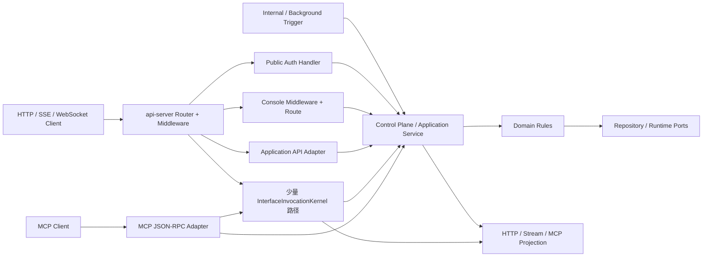
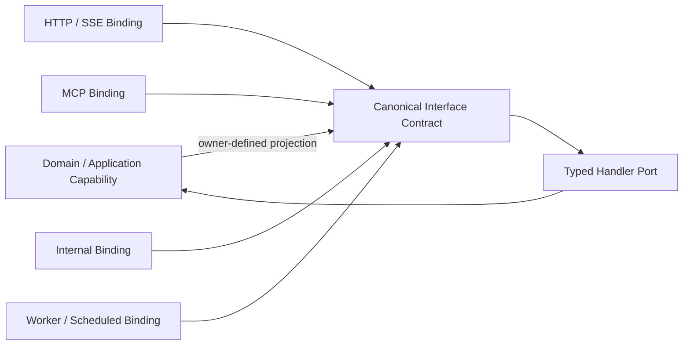
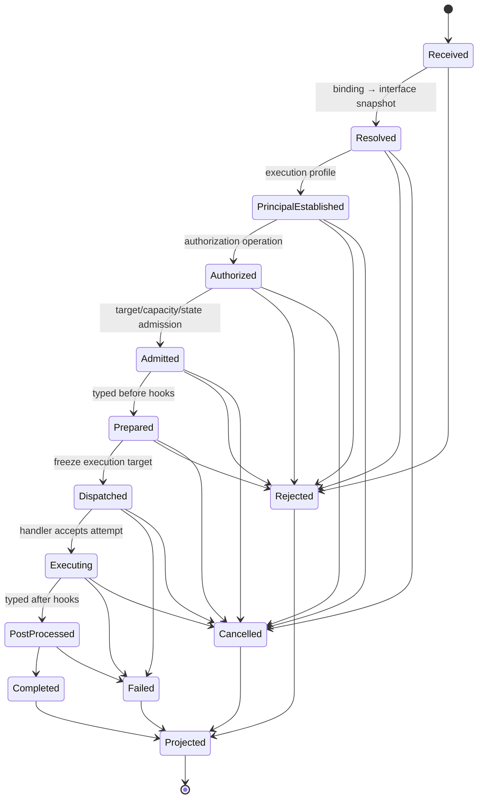
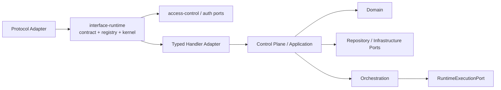

# ADR: Canonical Interface Contract 与 Invocation Lifecycle

## Status

Accepted for #1944 implementation（已冻结方向；实现与验收证据由 Work Packet Ledger 管理）

- 日期：2026-08-29
- 关联 Root：[#1893](https://github.com/taichuy/1flowbase/issues/1893)
- 集中架构审核：[#1944](https://github.com/taichuy/1flowbase/issues/1944)
- 源码基线：`beta@ff4cc74ab073256419884d3d96e0b3defcb36d45`

## Context

1flowbase 已有 HTTP、SSE、MCP、内部调用、后台任务、Domain Event、Lifecycle Outbox 和 Runtime Worker 等入口。当前认证、`ActorContext`、权限、Handler、事务、Runtime 与响应投影分散在 middleware、Route、Control Plane 和 Runtime adapter 中，只有少量生产接口进入 `InterfaceInvocationKernel`。

现有 `interface-runtime` 已提供重要基础：

- typed `InterfaceContract`；
- `InterfaceDefinition`、owner、permission、scope、lifecycle 和 handler binding；
- compiled registry、Graph/Registry fingerprint 和 snapshot publish；
- invocation lineage、deadline、AuthZ、admission、typed hooks、handler 和 terminal receipt；
- HTTP、MCP、Internal 三种 protocol identity。

这些基础尚未构成覆盖后端输入输出的完整 contract：

- `InterfaceDefinition` 只有 unary input/output，未声明 stream event、完整 error、idempotency、transaction、deadline/cancellation policy；
- `InterfaceAuthenticationPolicy` 声明 Anonymous/Authenticated，但 `InvocationEnvelope` 必须携带 `ActorContext`，匿名和非用户主体没有闭合；
- receipt 没有定义版本、owner、target/artifact、执行 attempt、时间点、错误分类和动态 Runtime generation；
- HTTP Route 只是单个可选字段，MCP/Internal binding 尚未成为与 canonical contract 一起编译的 typed projection；
- Hook 已有 before/after/failure/completion，但插件等级、权限、作用域、排序、mutation 和 failure policy 尚未在 Interface contract 中完整表达；
- 大量现有 Route 仍自行认证、授权和调用 Service，不能假定已经统一接入 Kernel。

架构收敛遵守三项硬原则：

1. **功能完整性**：内部调整不得改变现有 API、权限、数据、Runtime、插件 wire 和用户行为；
2. **Interface first**：后端输入、输出、stream、error 和 terminal 由协议无关 Interface contract 管理；
3. **时空可组合性**：插件贡献必须拥有明确 phase/scope 和被冻结的 Graph/Catalog/plugin/artifact/invocation 身份。

当前通用请求流不是一条统一管线，而是多个入口族各自装配：



因此本 ADR 的目标不是声称现状已经统一，也不是一次性替换全部 Route；目标是先形成唯一可编译的 Interface 语义目录，再按功能等价证据迁移调用路径。

## Decision

### 1. Canonical Interface 是后端调用面的唯一语义定义

Canonical Interface 位于协议 Adapter 与 Application/Domain 之间：



“唯一语义定义”不表示领域状态归 Interface 所有：

- Domain/Application 拥有业务规则、状态和 transaction invariant；
- Interface 拥有调用者可见的 typed request、response、stream、error 和 invocation policy；
- Adapter 只拥有 HTTP、MCP 等协议解析和投影；
- Handler 只把 canonical input 映射到 Application Port，不解析 Cookie/Header，不暴露 Store、Registry 或 Runtime Host。

一个业务能力可以有多个 Interface，但每个 Interface 必须声明独立、稳定的语义，不能让同一 Interface 根据 path/query/body 猜测不同权限或事务。

### 2. Canonical Interface Definition

目标结构不是一个包含全部可选字段的万能 Definition DSL，而是三个独立编译对象：

```text
CanonicalInterfaceDefinition（业务调用语义）
├─ identity
│  ├─ interface_id
│  ├─ interface_version
│  ├─ owner { kind, stable_id, version }
│  └─ lifecycle { desired, effective, scope }
├─ contracts
│  ├─ input { contract_id, version }
│  ├─ output { contract_id, version }
│  ├─ stream_event? { contract_id, version }
│  └─ target_error { contract_id, version }
├─ access
│  ├─ execution_profile
│  ├─ authorization_operation
│  ├─ admission_policy
│  └─ scope_policy
├─ execution
│  ├─ mode { unary, server_stream, async_ack }
│  ├─ handler_reference
│  ├─ target_reference
│  ├─ timeout_policy
│  ├─ cancellation_policy
│  └─ idempotency_contract?
├─ extension_space
│  └─ approved typed points/phases
├─ observability
│  ├─ audit_policy
│  ├─ sensitive_field_policy
│  └─ receipt_policy

ProtocolBinding（协议投影）
├─ binding_identity
├─ interface_identity
├─ http | mcp | internal | worker
└─ request/result/stream/error projection

CompiledInvocationPlan（发布后的不可变执行计划）
├─ definition + binding fingerprint
├─ activated authentication adapter + activation identity
├─ core + ordered extension authorization/admission executable plans
├─ typed handler binding
├─ typed hook executable plan
└─ graph/registry/plan fingerprints
```

要求：

- identity、contract 和 authorization operation 分别版本化，不能互相冒充；
- input/output/event/error 必须是 typed contract 或经 schema compiler 验证的 SDK contract，不接受无边界 `serde_json::Value` handler；
- binding 只能投影 canonical field，不得创建后端不存在的字段别名；
- 事务边界和业务一致性仍由 Application/Domain owner 持有；Interface 只声明调用者可观察的幂等语义，Kernel 不开启万能事务；
- Definition contribution 是 canonical RegistryCompiler 的 typed 输入，在 publish 前生成 Definition 及必需 Binding，不建立第二套 Registry，也不在请求时注入 Route；
- Definition、binding、authentication activation、handler、decision 与 Hook plan 分开拥有，编译后共同形成 deterministic plan fingerprint；
- erased Hook plan 必须暴露稳定 input/output `ContractIdentity`，RegistryCompiler 在 publish 时与 Definition 校验，不延迟到请求 downcast；
- duplicate identity/binding、unknown permission、missing handler、contract mismatch、inactive owner 和非法 extension point 必须在 publish 前 fail closed。

核心对象的唯一 owner 固定如下：

| 对象 | 唯一 owner | 不拥有 |
| --- | --- | --- |
| Canonical Interface Definition | `interface-runtime` contract types；业务模块贡献实例 | HTTP/MCP 解析、Store、事务实现 |
| Protocol Binding | `interface-runtime` binding contract；`api-server` 提供协议 adapter | 业务权限与业务状态 |
| Credential | HTTP/MCP/Worker Authentication Adapter | Application/Domain、普通插件 |
| Principal | 对应 Authentication/Profile owner；`interface-runtime` 只定义窄稳定形状 | 原始 token、Cookie、Repository |
| Authorization operation | `access-control`/领域授权 owner | Route 临时字符串判断 |
| Compiled Invocation Plan | `interface-runtime` Registry compiler | 动态 Runtime worker 选择 |
| Execution attempt | Handler/Orchestration/Runtime adapter | 覆盖 resolve-time plan |
| Invocation Receipt | `interface-runtime` lifecycle | Domain Event/Outbox delivery truth |

依赖规则采用现有 `interface-runtime`，本阶段不新增 crate。Application Principal 的稳定形状在 `interface-runtime` 表达，由 `api-server` 从 `ApplicationApiKeyActor` 投影；`interface-runtime` 不得反向依赖 `control-plane`。

### 3. Caller Identity 与 Authentication

Interface resolve 先通过不可信协议元数据找到 Definition 和 execution profile，再由该 profile 的 Authentication Adapter 解析凭证。Adapter 不把原始凭证传入 Handler 或普通插件。

Authentication registration 只是声明；BuiltIn/HostExtension 的 concrete factory 由 `api-server` Composition Root 从可信 native entrypoint catalog 激活。factory 接收协议层的短生命周期 typed credential（例如 Header、Bearer 或 server delegation），调用既有认证 owner，并返回 sealed Principal；它不是对已构造 Principal 的 downcast 检查。发布时必须双向严格配对 registration、factory、adapter identity、activation identity、Principal profile 和 credential contract，Protocol Adapter 只能从冻结 Binding/Plan 取得 factory、完成认证后再构造 Envelope。缺失、多余、重复、未激活或 identity mismatch 都阻止 catalog/router publish。

可信 HostExtension 的 Authentication contribution 是 `1flowbase.host-extension/v1` 的 typed、
向后兼容 boot input。它声明目标 Interface/version、完整 Binding identity 集、adapter/activation
identity、Principal profile 与 credential contract，并作为
`1flowbase.interface.authentication-adapter` contribution 进入 Effective Graph。Composition Root
只为已编译进宿主的 trusted native entrypoint 提供 concrete factory；Graph registration、native
factory 与 canonical Registry 必须在 router publish 前双向一致。该 contribution 只选择既有静态
Protocol Route 的 Authentication owner，不动态创建 Axum Route，也不建立第二套 Definition Registry。

active Console Interface Route 在通用 Console middleware 调用 `require_session` 前移交 frozen
factory；credential rejection 与成功 Principal 都由该 factory 首次产生。核心权限仍由 Kernel 的
core Authorization 决定。未迁移的 Console Route 继续使用既有 middleware，因此零 contribution
时外部认证、权限、CSRF 与 DTO 行为不变。

原始 credential 只存在于 `api-server` Authentication Adapter 的瞬时调用中；不得进入 `interface-runtime`、Compiled Plan、Envelope、Receipt、Handler、Application/Domain 或普通 Runtime/Capability extension。RuntimeExtension 与 CapabilityPlugin 不能注册 Authentication factory。

统一的是 lifecycle engine，不是一个万能 caller enum。Envelope 对 Principal 类型参数化：

```text
InvocationEnvelope<I, P>
                  │
                  └─ P: InvocationPrincipal（sealed typed profile）

当前有代码证据的 Profile
├─ PublicPrincipal
│  └─ 不携带凭证；只允许 Definition 明确标记的公开操作
├─ UserPrincipal
│  └─ ActorContext + credential kind reference
└─ ApplicationPrincipal
   └─ application/api-key identity + authorized ActorContext/scope

待真实入口证明后再加入
└─ Internal/System/Plugin principal profile
```

约束：

- Profile 和 Principal 使用封闭 typed contract，不使用字符串、`serde_json::Value` bag 或包含所有身份字段的 Optional Context；
- `ActorContext` 继续是用户/角色/Workspace 授权真值，不被宽化成万能 Context；
- Application 身份不能只降格为普通用户；必须保留 application、api_key、workspace 和 delegation identity；
- Receipt 和普通插件只看到裁剪后的 `PrincipalSummary`，不获得完整 Principal；
- System/Plugin 作为 Interface caller 与“插件注册 Interface/Hook”是两件事；没有真实调用入口和授权语义前不提前加入；
- HostExtension authenticator 可以作为可信 Authentication Adapter 扩展，但普通 Runtime/Capability 插件不得读取 Cookie、Bearer token、session secret 或 API key 原文。

### 4. Invocation Envelope

认证完成后，Adapter 生成协议无关 Envelope：

```text
InvocationEnvelope<I>
├─ lineage { invocation_id, parent_invocation_id }
├─ interface_identity { id, interface_version }
├─ contract_identity { input, expected output/event/error }
├─ protocol_binding_identity
├─ principal: P
├─ principal_summary
├─ scope { tenant?, workspace?, session? }
├─ deadline
├─ cancellation
├─ idempotency_key?
├─ interface_snapshot { graph, registry, plan fingerprint }
└─ input: I
```

Envelope 不得携带：

- Axum Request、HeaderMap、Cookie jar 或 MCP transport object；
- `ApiState`、Store、Repository、Registry、Runtime Host、process/path；
- 无边界 capability container；
- 由客户端声称、但未由 Authentication/Domain owner验证的角色、Workspace、owner 或 permission。

### 5. 完整 Invocation Lifecycle

生命周期分成 Adapter、Canonical Kernel、Application/Target 和 Projection 四段：



阶段语义：

| 阶段 | Owner | 关键不变量 |
| --- | --- | --- |
| Received | Protocol Adapter | 只做协议限制、解析和 correlation，不执行业务 |
| Resolved | Interface Registry | 冻结 Definition、binding、Graph/Registry/Hook plan identity |
| PrincipalEstablished | Authentication Adapter | 产生 profile-specific Principal；Public 产生无凭证 Principal，原始凭证到此终止传播 |
| Authorized | Authorization Port | 只判断 operation，不修改领域状态 |
| Admitted | Target Admission Port | 校验目标状态、容量、租约或可执行性 |
| Prepared | Typed before plan | 只执行声明允许的 bounded mutation/decision |
| Dispatched | Execution Adapter | 冻结 handler/runtime/artifact generation 和 attempt identity |
| Executing | Handler/Application | 执行业务用例、事务或 Runtime 调用 |
| PostProcessed | Typed after plan | 观察 typed output；不得改写已提交业务结果 |
| Completed/Rejected/Failed/Cancelled | Kernel | 恰好一个 terminal，运行 failure/completion plan |
| Projected | Protocol Adapter | 把 canonical output/error/stream/terminal 映射回来源协议 |

Authentication 失败可以直接产生 `Rejected` receipt；Public Profile 也不需要构造伪造的 `ActorContext`。调用进入 `Dispatched` 后必须具有 execution attempt，重试产生新的 attempt，不能让同一 attempt 被两个 target 执行。

### 6. Output、Stream、Error 与 Terminal

Canonical result 区分业务输出、流式事件、target error 和 platform terminal：

```text
InvocationResult<O, E, S>
├─ unary output: O
├─ stream events: S* + exactly-one terminal
├─ target error: E
└─ platform failure
   ├─ unknown_interface
   ├─ authentication_rejected
   ├─ authorization_rejected
   ├─ admission_rejected
   ├─ contract_mismatch
   ├─ deadline_elapsed
   ├─ cancelled
   └─ target_unavailable
```

规则：

- HTTP status、SSE event name、MCP error code 是 binding projection，不是 canonical error identity；
- stream event 与 terminal 分开，任何流只能产生一次 terminal；
- failure/completion hooks 接收分类和冻结身份，不接收任意内部 error object；
- sensitive output/error 字段必须在 canonical policy 中声明，由 Adapter 统一执行日志和协议投影脱敏；
- 已产生 stream event 或业务副作用后，不得静默切换插件版本并把它当作同一次 attempt。

### 7. Interface Extension Space

插件扩展以 Interface phase/point 为坐标。以下是目标空间，不在本 ADR 提前批准每种插件等级：

| Extension point | 输入/输出 | 可做什么 | 默认边界 |
| --- | --- | --- | --- |
| `interface.definition` | typed Definition contribution | 注册新 Interface/binding | publish 前编译；不得运行时注入任意 Route |
| `interface.authentication_adapter` | credential reference → typed Principal | 增加可信认证方式 | 仅可信 Host 级；原始凭证不出 Adapter |
| `interface.authorization` | typed Principal + Definition → typed decision | 参与授权决策 | fail closed；不得改状态；普通插件只见 PrincipalSummary |
| `interface.admission` | PrincipalSummary + target facts → decision | 容量、状态、配额准入 | fail closed；typed facts only |
| `interface.before` | typed input → bounded mutation/decision | 参数检查、允许字段改写 | mutation capability 必须显式声明 |
| `interface.handler` | profile-specific Principal + typed input → typed result | 提供接口实现 | exactly one effective target；只注入声明所需 Principal profile |
| `interface.after` | typed output | 观察成功结果 | reverse order；不得改已提交结果 |
| `interface.failure` | classification + frozen identity | 观察失败 | best-effort 或 required 必须由 point 声明 |
| `interface.completion` | terminal + frozen identity | 观察所有 terminal | 不等同于 durable Domain Event |

每个 contribution 必须声明：

```text
plugin identity + version
point/phase + contract version
scope
required/granted permissions
ordering dependencies
mutation capability
failure/delivery semantics
activation lifecycle
handler/artifact identity（如适用）
```

Built-in、HostExtension、RuntimeExtension、CapabilityPlugin 分别可以进入哪些 point，将在 Interface contract 确认后形成独立能力矩阵。安全不能只依赖 manifest permission：Host/Kernel 必须把权限转化为实际可注入的窄 Port、typed facts 和 process/wire 边界。

Authorization 和 Admission registration 必须在 publish 时与 typed executable binding 一一配对，其顺序、Graph、contract、permission 全部冻结进 Compiled Plan。Kernel 对 unary/server-stream 执行相同链路：core Authorization 先决策，extension Authorization 只能附加 veto；core Admission 先决策，extension Admission 只能附加 reject。任一 required extension deny/reject/error/timeout/unavailable 均 fail closed，插件 allow 不能覆盖 core deny。普通 Runtime/Capability extension 只获得 `PrincipalSummary` 和 point 授权的 typed facts；零 contribution 时保持现有 core 决策行为。

### 8. 时空可组合身份

一次 invocation 由两次冻结组成：

```text
Resolve-time pin
├─ Interface Definition/version
├─ Graph fingerprint
├─ Interface Registry fingerprint
├─ Hook/decision plan fingerprint
└─ protocol binding identity

Dispatch-time pin
├─ execution attempt ID
├─ handler target identity
├─ plugin/runtime version
├─ installation/artifact identity
├─ Runtime Catalog generation/fingerprint
└─ Worker generation（如适用）
```

Resolve 后 Registry 发布新版本，不覆盖本次 Interface plan；dispatch 前 Runtime V2 已 Ready 并成为 active generation，可以为本次 dispatch 冻结 V2。已经 dispatch 到 V1 的 attempt 继续使用 V1，直到 completed/failed/cancelled，再 drain V1。

最终 receipt 至少记录：

```text
invocation/parent/attempt identity
interface/contract/binding identity
principal profile and authorized scope reference
Graph/Registry/Hook plan fingerprint
handler/plugin/artifact/runtime/worker generation
stage timestamps
terminal and error classification
idempotency/retry lineage（如适用）
```

定义 request/attempt identity 不等于修改现有插件 stdio wire。Host adapter 可以在不改变插件 contract 的情况下维护外层 execution receipt。

### 9. Owner 与依赖方向



边界：

- `interface-runtime` 不依赖 Axum、MCP server、Control Plane 实现、Storage、Plugin Framework 或 Runtime Host；
- Protocol Adapter 不直接启动 Worker、查询 Host Registry 或决定插件版本；
- Domain 不依赖 Interface、HTTP/MCP、Plugin Framework 或 Runtime Host；
- Orchestration 只持有稳定 execution Port，不持有完整 Host/Backend 内部类型；
- Composition Root 绑定 concrete Authentication、Authorization、Handler、Repository 和 Runtime adapter。

### 10. 功能等价迁移规则

现有 Route 不一次性重写。实施前先生成有限 Interface Coverage Inventory：

```text
method/path or protocol tool
current request/response/stream/error
authentication source
Actor/scope construction
authorization operation and row rules
CSRF/idempotency/deadline/cancel
service/transaction/runtime target
observable side effects
current tests and external consumers
```

每个迁移项必须证明：

```text
effective_before(input, principal, state)
=
effective_after(input, principal, state)
```

比较范围包括 allow/deny、状态变更、返回 DTO、错误分类、stream 顺序、事务提交、Outbox、Runtime dispatch 和审计。不能证明等价的路径进入 gap ledger，不增加 fallback。

开发仍遵循 Root #1893 集中控制：全部 contract、adapter、fixture Work Packet 装配完成后，只对冻结 assembly 运行一次 fresh centralized QA；不为单 Route、单 crate 或单 Packet 重复启动 QA。

### 11. 后续讨论顺序

本 ADR 接下来按以下顺序补齐证据，不新建分层审核 Issue：

1. 审核并确认 Definition、Binding、Principal Profile、Envelope、Lifecycle、Result 和 Receipt；
2. 建立现有 Interface Coverage Inventory；
3. 映射 Console HTTP、Application/SSE、MCP、Internal、Worker ingress；
4. 核对 Handler → Application → Domain → Transaction → Repository/Runtime owner；
5. 冻结四类插件的 Extension Space 能力矩阵；
6. 最后审计 Domain Event、Lifecycle Outbox、通知和广播与 Interface completion 的分界；
7. 形成有限 Work Packet、controlled negative 和唯一集中 Test Batch。

在第 1～3 步确认前不修改产品代码；在 Interface 与插件边界确认前不实现内部事件统一或 Remote Backend。

## Rationale And Mechanism

Interface first 把必要复杂度放到能同时观察调用者、operation、contract、target 和 terminal 的层。协议 Adapter 不再拥有业务权限，Application 不再理解 Cookie/MCP，插件也不需要获得 Store 或 Host 内部对象才能扩展接口。

两阶段 pinning 同时解决稳定性和升级及时性：Interface policy 在 resolve 时固定，Runtime target 在 dispatch 时选择当前 Ready generation；新调用及时使用新版本，在途调用仍可复现。

typed phase/point 让插件的“空间”可编译，snapshot/generation/receipt 让插件的“时间”可还原。它比万能 Hook、动态 Route 或 JSON RPC 更适合开放 SDK，也为未来 Remote Runtime 保留了不修改业务 Route 的适配切口。

## Alternatives Rejected

- **继续让 Route/Handler 各自拥有认证、权限和 DTO**：不能形成跨 HTTP/MCP 的稳定 contract，也无法给插件提供一致生命空间。
- **把 HTTP/OpenAPI 当 canonical contract**：URL、Header、media type 会泄漏到 Application，MCP/Internal 只能二次适配。
- **让全部入口共享一个万能 RequestContext**：Store、Registry、Host 和协议对象会穿透边界，权限无法最小化。
- **所有能力立即进入同一个 Kernel**：缺少 Coverage Inventory 和等价证据，会造成大爆炸重写并危及功能完整性。
- **用万能 JSON Hook/Handler 获得插件扩展性**：无法在编译期证明 input/output、permission、mutation 和 failure semantics。
- **把 Interface completion 当作全部 Domain Event**：调用 terminal 与领域提交事实具有不同 owner、事务和 delivery 语义。

## Risks And Reversibility

- Canonical Definition 若一次承载过多可选字段，会退化为配置 DSL；实施前应按窄 typed value object 分组，调用方只依赖需要的 section。
- 当前已证明 Public、User 和 Application 三类 Principal Profile；Internal/System/Plugin caller 仍需用真实入口和授权语义证明，不能凭完整感扩张。
- idempotency contract 只能声明调用者可观察语义，真实 transaction invariant 仍由 Application/Domain/Repository 执行；Kernel 不得自行开启万能事务。
- before hook mutation 是高风险能力，必须按字段/能力显式授权；若无法建立窄 mutation contract，应退回 observe/decision-only。
- 迁移期间不得长期双跑旧 Handler 和新 Kernel；允许测试 fixture 比较，不允许生产双写或模糊 fallback。
- 本 ADR 仍为 Proposed，可在实施前调整 contract；一旦 SDK、外部 API 或持久化 receipt 发布，版本和兼容策略必须独立 ADR 决策。

## Evidence

- `api/crates/interface-runtime/src/registry.rs:17-65`：现有 typed contract、Definition、auth/audit/error/scope/lifecycle。
- `api/crates/interface-runtime/src/registry.rs:282-482`：Registry compiler、handler/permission/contract negative 与 compiled snapshot。
- `api/crates/interface-runtime/src/invocation.rs:26-147`：Invocation lineage、protocol 和当前 Actor-only Envelope。
- `api/crates/interface-runtime/src/invocation.rs:305-430`：当前 stage、terminal、receipt 和 error inventory。
- `api/crates/interface-runtime/src/invocation.rs:438-738`：Resolve、AuthZ、admission、hooks、deadline、handler 与 terminal 执行顺序。
- `api/crates/interface-runtime/src/hook.rs:11-199`：typed before/after/failure/completion Hook Plan。
- `api/apps/api-server/src/lib.rs:199-303`：当前 HTTP Router families 与 middleware 装配。
- `api/apps/api-server/src/middleware/require_session.rs:11-157`：当前 Cookie/user API key/server delegation 与 ActorContext 构建。
- `api/apps/api-server/src/middleware/require_settings_feature_permission.rs:68-112`：Console compiled AuthZ 与 typed Interface 分支。
- `api/apps/api-server/src/routes/settings/host_infrastructure/interface_operation.rs:187-285`：当前 HTTP/MCP 共用 typed Interface 的生产示例。

本轮只替换 ADR 讨论稿，不修改产品代码、测试、数据库、外部 contract 或运行时行为，不启动 QA。
