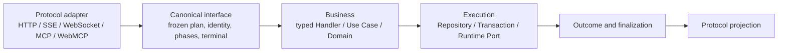
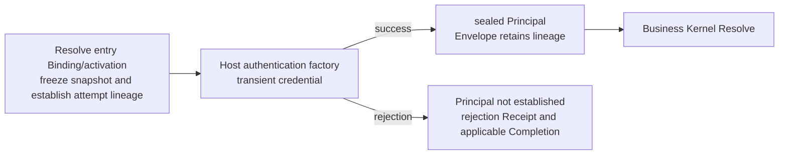

# Request architecture and invocation lifecycle

[中文](interface-lifecycle.md) · [Architecture](README.md) · [Plugin composition](plugin-composition.en.md)

This document defines the request architecture and invocation lifecycle. AGENTS files hold execution rules; skills hold implementation and acceptance methods. Historical acceptance does not certify every current interface.

## One call, end to end



These arrows describe calls, not Cargo dependencies. Host authentication completes before business Kernel Resolve. The public/console/runtime endpoint partitions are not the responsibility planes shown above.

| Question | Section |
| --- | --- |
| Where do requests enter, and who owns the work? | [Ingress and ownership](#ingress-and-ownership) |
| Who is calling, and which identities are frozen? | [Contracts and identity](#contracts-and-identity) |
| What can an extension do at each phase? | [Execution and extensions](#execution-and-extensions) |
| How do disconnect, cancellation, commit and finalization relate? | [Finalization and delivery](#finalization-and-delivery) |
| What proves compatibility? | [Equivalence and evidence](#equivalence-and-evidence) |

Equivalent GUI/HTTP and MCP/WebMCP business intents use the same core permissions, business rules and terminal semantics. Protocol wrappers and invocation IDs can differ, while lineage and effects must satisfy their respective contracts.

## Maintenance boundary

Architecture invariants are separate from implementation coverage and candidate acceptance. Interface lifecycle contracts provide a foundation; opening plugin capabilities then requires evidence from actual declarations, loading, composition and execution. A controlled typed-plan test does not prove real plugin activation. A legitimate empty extension plan is not itself a defect.

Crate ownership and allowed dependencies are maintained in [crates/AGENTS.md](../../api/crates/AGENTS.md), with Host rules in [api/AGENTS.md](../../api/AGENTS.md). Documentation synchronization does not authorize new runtime behavior, permissions or transaction semantics.

<a id="ingress-and-ownership"></a>

## Ingress and ownership

The actual Router and Endpoint Inventory are derived from the same route construction declarations. The composition root compiles the Effective Graph, activated authentication factories and typed handlers into a registry snapshot, then cross-checks mount, catalog, binding and protocol projections before publication. A second handwritten list cannot prove actual route coverage. Adapters stay static; requests do not construct new routes or splice execution plans.

```text
ActualEndpoints = Business ⊎ ProtocolControl ⊎ OperationalControl
Business Endpoint -> exactly one Binding -> exactly one Compiled Plan
```

These are disjoint endpoint categories, not a restriction to one Binding per Interface. Missing classification, duplicates, unknown bindings, absent mounts and conflicting business/control classification reject publication. Calling a business route “control” does not exempt it from the Kernel.

| Plane | Owns | Does not own |
| --- | --- | --- |
| Protocol Adapter | Parsing, credential boundary, protocol projection | Business execution bypassing the plan |
| Canonical Interface | Definition, Binding, Plan, phases, Receipt | Transactions, credential parsing, plugin loading |
| Business | Authorization policies, invariants, state transitions, transaction intent | Cookie/SSE/MCP parsing |
| Execution | SQL, storage, orchestration and narrow runtime operations | Redefining business permissions or invocation identity |

`api-server` is the composition root and injects stable typed ports. This does not authorize `interface-runtime` to depend on services, storage, Plugin Framework or Runtime Host; its internal crate dependency is `domain`.

HTTP/SSE/WebSocket and MCP/WebMCP retain their input, error and streaming contracts. WebMCP owns its outer lifecycle; downstream invocations are related by lineage and cannot finalize it on its behalf. A runtime worker is an execution target after Dispatch; a background worker or scheduler is an active caller. Their complete ingress set, System Principal and durable retry/ACK responsibilities require explicit ownership and evidence.

Source entry points: [route assembly](../../api/apps/api-server/src/external_route_assembly.rs), [endpoint catalog](../../api/apps/api-server/src/external_endpoint_catalog.rs), [WebMCP interface](../../api/apps/api-server/src/routes/webmcp/interface.rs).

<a id="contracts-and-identity"></a>

## Contracts and identity

| Object | Question answered |
| --- | --- |
| Interface Definition | Which typed capability, permissions and execution mode? |
| Protocol Binding | Which protocol entry exposes that capability? |
| Principal | Who is calling, with which trusted authorization context? |
| Compiled Plan | Which authentication, authorization, admission, hooks and handler apply? |
| Attempt | Which target and runtime generation execute this attempt? |
| Receipt | Which phases, observations and terminal actually occurred? |

Definition does not own HTTP headers, transactions or workers. Binding does not own business rules. Resolve uses an explicit binding ID and protocol, never whichever Binding is first in a container.

### Authentication terminates credential propagation



PublicPrincipal does not invent an Actor. UserPrincipal/ApplicationPrincipal carry authoritative ActorContext; Application also carries the required application, API-key identity and workspace identity. Raw cookies, bearer tokens, session secrets and API keys never reach Kernel, Handler, Receipt or ordinary plugins.

After entry Binding/activation resolution, the authentication attempt establishes correlation before validating credentials. Rejections publish safe classification, phase/time and frozen identity to Host observation; constructing and discarding a record is insufficient. Failure to authenticate must not become Public or an empty Actor.

Unresolved Binding/activation, protocol syntax errors and authentication bootstrap belong to ingress diagnostics; they must not fabricate a resolved business plan. Delegated/WebSocket identity reuse follows its existing contract without skipping delegation checks. Separate calls/messages retain their invocation identities.

### Restricted variants on one HTTP carrier

Unary Compact may project to SSE, while a valid tool callback may continue an existing streaming resume. Wire format alone does not determine execution mode.

When authenticated context is required to select a variant, a successful authentication attempt may be consumed before business Resolve. Selection must retain the same frozen snapshot, HTTP method/route, full authentication activation/adapter/policy, Principal profile and input contract. Registered output or execution modes may differ; the selected complete plan must still run.

Unknown bindings, other entry routes or mismatched authentication reject selection. Do not reauthenticate, reread a mutable registry or fall back to a Principal-only Envelope that loses lineage. Authentication failures use the original entry candidate plan. Binding/Plan cannot change after business Resolve.

### Two freezes

```text
Resolve-time: Interface / Binding / Graph / Registry / Plan
Dispatch-time: Attempt / Handler / Target / Artifact / Runtime / Worker generation
```

In-flight calls retain their snapshot. A dispatched target/generation cannot be overwritten; retry has a new Attempt identity and increasing ordinal. This invariant does not itself implement durable retry scheduling or full attempt-history aggregation.

<a id="execution-and-extensions"></a>

## Execution and extensions

Managed plugin permissions are defined by the [lifecycle permission table](plugin-lifecycle-contracts.en.md#managed-interface-phase-permissions).

```text
Resolve / confirm sealed Principal
  -> Core Authorization -> ordered extension vetoes
  -> Core Admission -> ordered extension vetoes
  -> typed Before -> Dispatch / freeze target -> exactly one typed Handler
  -> success: After / failure: Failure
  -> applicable Completion -> Terminal Receipt -> protocol projection
```

Cancellation can occur at controlled waits and finalizes the phases actually reached. Host credential validation is not repeated by the Kernel. Core denial cannot be reversed by an extension allow, and rejected calls do not run the Handler. Real registration must compile the Definition, Decisions, Hooks and Handler; a handwritten fingerprint is not executable binding.

Received belongs to protocol parsing and correlation. Resolve freezes the plan and confirms trusted identity; Authorization and Admission belong to their business owners. Prepared follows the actual typed Before contract. Dispatch freezes the target; the business owner still owns the transaction. After/Failure/Completion observe, while Terminal and Projected separately record invocation outcome and protocol projection.

### Coordinates and open capabilities

Coordinates include definition, authentication adapter, authorization, admission, before, handler, after, failure and completion. The existence of a coordinate does not grant all plugin kinds equal permission. Spatial identity includes Interface, point/phase, scope, permissions and isolation; temporal identity includes version, graph/registry, artifact/generation, Invocation and Attempt.

A valid empty plan executes the core lifecycle. An applicable bound plan executes in frozen order or records why a step did not run. Invalid declared implementations reject assembly rather than silently becoming an empty plan. Actual plugin opening needs declaration → loader/activation → graph/registry → invocation evidence, including dependency order, conflicts, disablement, version switching and in-flight isolation. Native HostExtensions remain restart-scoped, not hot-unloadable Rust libraries.

Generic managed interfaces derive `1flowbase.interface.{interface_id}.{phase}` coordinates from compiled contracts and execution plans. Authorization / Admission may continue or deny. Before / After / Failure / Completion only observe: no input patching, primary-result replacement or error recovery. The legacy Create adapter separately retains its read-only, veto-capable Before; that capability is not generalized to the generic interface protocol. Host outcome validation enforces this distinction.

Each Rust contract supplies both a bounded safe-projection schema and encoder; missing either prevents opening it. Inputs and successful outputs exclude raw credentials, session/token data, header bags, native handles, local paths, unbounded binary and raw error chains. Dynamic JSON represents defined safe fields or finite metadata. A standard JSON Schema engine validates a restricted vocabulary without external references. Schema validation does not replace authorization or sealed identity. Discovery, invocation factories and handlers consume the same frozen contract. Real stream owners finalize Completion once at stream terminal, without replacing the business result on observer failure.

### Schema registration and reference transport

The Host compiles complete safe-projection schemas at catalog registration, binding validators, contract ID/version and normalized fingerprints to the frozen snapshot. Any invalid contract rejects the batch, with contract identity, schema path, rule and budget diagnostics. Each call validates its original projection with that compiled validator rather than recompiling or dropping fields/output branches.

```text
Registration: full schema -> validation/compilation -> frozen contract and handler binding
Call: original safe projection -> bound validator -> exact contract reference + data -> worker
```

Reference calls carry `contract_id`, `contract_version` and `schema_fingerprint`, not the schema. These identify structure, not authority. Exact installation, handler, binding fingerprint, frozen candidate and current permissions still govern execution; unknown/mismatched references, stale bindings and invalid projections reject at the Host. The SDK validates reference/data boundaries and request/reply correlation without a cross-call resident schema cache or implicit schema download.

The public legacy `ManagedProjectionContract.compile()`, full-schema frames and `serve_managed_interface_hook` remain supported. Optional execution-binding `interface_protocol` explicitly selects reference transport; omission preserves serialization, existing manifest fingerprints and selection. Explicit selection contributes to the binding fingerprint. Parsing failure never triggers implicit fallback. `runtime.protocol` selects execution transport, while extension-point `contract_version` describes the contribution contract; neither substitutes for wire-version selection. Legacy Create, schema-carrying interface v1 and reference v2 remain distinct.

Current independent wire budgets are 128 KiB for Host schema registration, 64 KiB per reference safe projection, 96 KiB per request and 8 KiB per reply. Existing structural depth/object/array/string restrictions remain. Legacy schema compilation remains 32 KiB and legacy interface/Create frames 64 KiB; events use their own validator. These budgets do not imply one another or a business-record capacity. Actual admission, compile cost and measurable memory require candidate-bound probes and acceptance; constants alone prove none of them.

### Contract-driven events

Plugins declare namespaced `contract_id`, exact version and finite payload schema. Host installation identity, current contribution grants and the frozen graph validate publishers/subscribers. Generic event wire v2 carries schema-validated payload, not self-asserted workspace, publisher or idempotency identity. The graph defines declarations; an authority lease governs current execution. Revocation and stale leases must reject before writing.

Outbox owns independent subscriber claim/ACK/retry. Only declared and authorized owned-collection typed upserts are accepted; receipt and those effects commit atomically, making repeated delivery idempotent for Host transaction effects, not arbitrary external side effects. History, recovery, retirement and cleanup use durable payload and exact installation/artifact/handler/binding identity, never reinterpret an old event using today's selected version. Unknown legacy history remains conservative; same-version/different-archive rejection remains. [Plugin composition](plugin-composition.en.md) describes the earlier concrete example; generic coverage is tied to Root #2014 candidate evidence.

### Native settings pages and template application

A native manifest's `settings_pages` binds fixed page files to SettingsFeature, routes and templates. A page-only contribution may have empty `api_routes` without inventing a linked handler, but still has an owner and page-access permission. Real APIs require actual bindings and independent operation authorization. The Host resolves and validates page source through its boot-registered typed route ID; the frontend neither infers plugin ownership nor gains core API authority from page visibility.

```text
Installed artifacts (possibly several)
 -> canonical plugin family + scope select exactly one installation
 -> selection_revision fences stale attempts
 -> application_generation identifies first enable / explicit version switch
 -> boot validation and assembly
 -> atomic template + successful-application marker commit
 -> matching page/route becomes available
```

Selection and actual node execution are separate: selecting v2 while v1 runs means restart pending, not hot unload, automatic fallback or selection by semver/traversal order. Ambiguous legacy candidates fail closed until an administrator selects an exact installation through enable. Other artifacts and history remain.

First enable or explicit version switch creates a template application identity and replaces the plugin's owned templates, including user edits. Ordinary restart or same-version re-enable does not overwrite again. There is no content comparison, merge or automatic preservation. Templates and success marker commit together after rechecking target/revision in the same transaction; a lock is not authorization. Failure to load after commit records failure; retry reuses the successful marker instead of overwriting subsequent edits.

Each process retains immutable assembly identity. Navigation, plugin operations and template source share a version gate: an old process cannot combine a new template applied by another process with its old backend. Multi-node gating does not promise atomic cluster-wide cutover. Editing and enable/upgrade flows explain overwrite timing. Business configuration, credentials and roles are outside template replacement.

<a id="finalization-and-delivery"></a>

## Finalization and delivery

Invocation terminal, business transaction commit/rollback and protocol delivery/ACK have independent owners. The Kernel records invocation outcome; the transaction owner commits business changes and required Outbox facts atomically; adapters record projection/delivery. A committed business effect is not undone because projection fails. Completion is not subscriber ACK.

The primary terminal—Completed, Rejected, Failed or Cancelled—is fixed before applicable finalization observers. Receipt records both intended outcome and what finalization actually did. Protocols retain status, headers, structured errors, stream events and established projection contracts. Stream creation is not stream completion; partial delivery and projection failure cannot be reported as confirmed delivery. Observer failures do not replace upstream business errors or fabricate rollback.

Unary Output, Stream Events, Target Error and Platform Failure are classified by the canonical contract before mapping to HTTP status/body, SSE events, WebSocket frames or MCP result/error. Different protocol error wrappers must not discard business-error semantics. Sensitive authentication data is trimmed at its security boundary; provider stdout/stderr/upstream errors retain their established forwarding contract. Generic redaction is not permission to rewrite, truncate, translate or swallow troubleshooting evidence.

### Independent observation budget

Applicable After/Failure/Completion share an independent **1,000 ms total budget**. Business cancellation/deadline does not directly cancel it, allowing quick Completion observers to run. Observer failure, panic or timeout cannot overwrite the primary result.

Each applicable Hook records identity, point, Executed/Failed/TimedOut/NotRun and safe reason. Budget exhaustion cannot be recorded as success. Timeout relies on cooperative trusted native async code: it cannot guarantee preemption of a blocked thread or execution after process kill. Reliable effects belong in transactions and Outbox.

### Disconnect is not business cancellation

```text
Disconnect / writer failure / bridge task abort
  -> stop this connection's delivery
  -> retain an independent completion owner

Explicit business cancel API
  -> request a business state transition
  -> project the cancellation terminal under the existing protocol
```

`InterfaceStreamCompletion::complete()` has an explicit owner that awaits it; dropping the handle does not prove completion. WebSocket bridging transfers completion to an independent task so transport task exit cannot lose Kernel finalization. A background task's existence still does not prove client delivery.

Disconnect does not automatically cancel business work, and business cancellation does not guarantee that a remote provider stops computing. This architecture does not add `response.cancel` to Responses WebSocket; explicit cancellation uses the existing Native API. Outbox lease/retry/deduplication/per-subscriber ACK and PluginData local idempotency remain with their respective owners, not an implicit global exactly-once guarantee.

Sources: [finalization](../../api/crates/interface-runtime/src/finalization.rs), [stream ownership](../../api/crates/interface-runtime/src/stream.rs), [WebSocket bridge](../../api/apps/api-server/src/routes/application_public_api/responses_websocket/turn_bridge.rs).

<a id="equivalence-and-evidence"></a>

## Equivalence and evidence

Fix business intent, identity/permissions, initial data and configuration when comparing pre/post-refactor behavior. Lock protocol wrappers separately before comparing HTTP/MCP business semantics. Verify actual mount/dispatch/bindings; valid, missing, invalid and unauthorized inputs; scope isolation; fields, array order, status, full errors/messages, stream order/terminal; persistence and non-target rows; grants/audit/commit/rollback; frozen identities, cancellation, timeout, observer and delivery failure.

First match each response ID to its own persisted object, then normalize random IDs across protocols. Agreement between two new implementations cannot alone prove old-version compatibility. Preserve a baseline contract, source identity or fixture; do not sort arrays or erase error details to hide differences.

Online lifecycle evidence needs a controlled first-delta barrier, confirmation that execution is running, the disconnect/cancel action, connection-state confirmation, barrier release and checks of business/delivery results. A fixed sleep proves no ordering. Concurrency needs simultaneously live server connections, isolated run/nonces and no crosstalk. An intentionally serial provider pool is not a regression merely because upstream calls do not overlap; connection concurrency alone proves no performance equivalence.

Error matrices must execute each real request and check original errors, wire terminal and durable results. Retry checks failure and subsequent success separately; retain timing/trace/durable evidence from failed rows and identify evidence-collection failures independently.

Cargo exit success does not prove selected tests ran. A declared matrix does not prove online cases executed. Direct mock WebSocket evidence is not Gateway evidence; service tests are not HTTP/MCP authentication tests; controlled plans are not real plugin loading; a scoped pass is not full-repository, frontend, performance or exhaustive-input acceptance. Evidence records SHA, commands/scenarios, actual counts and artifacts. Reused evidence retains its original execution SHA and explains why relevant source/fixture/config changes do not invalidate it.

Existing entry points include [HTTP/MCP paired fixtures](../../api/apps/api-server/src/_tests/interface_lifecycle_acceptance/create_pair.rs), [stream finalization](../../api/apps/api-server/src/routes/application_public_api/responses_websocket/tests/turn_finalization.rs), [online lifecycle](../../scripts/node/ai-gateway-concurrency/responses-websocket-acceptance/lifecycle.js) and [online error matrix](../../scripts/node/ai-gateway-concurrency/responses-websocket-acceptance/error-matrix.js). These are test locations, not claims that this documentation update reran them.

## AI Native traces and protocol diagnostics

Mapping, AI Native and provider plugins retain their execution and translation responsibilities. Capture switches, completeness, semantic/raw readers and historical sources are maintained in [AI Gateway evidence](ai-gateway-observation.en.md#ai-native-traces-and-protocol-diagnostics).
