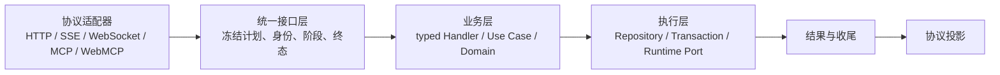
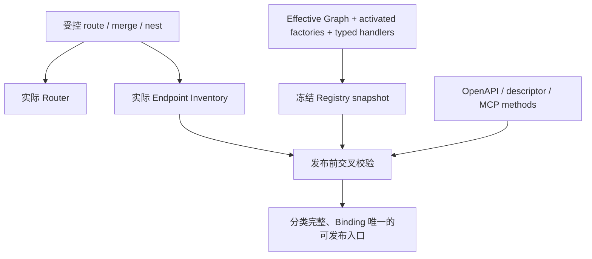
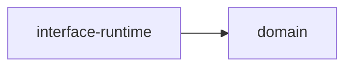
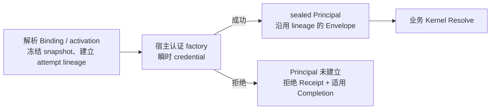
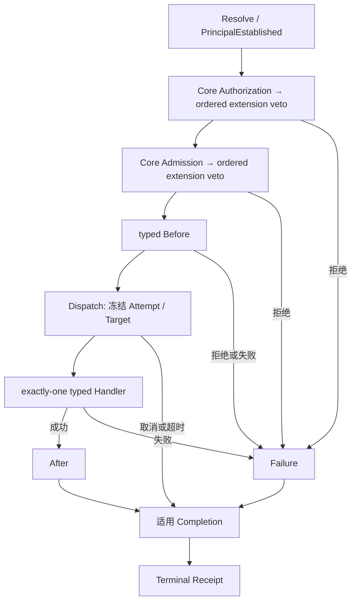
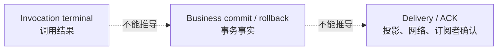

# 请求架构与调用生命周期

本文集中维护请求架构与调用生命周期，先看总体结构，再按目录定位主题。AGENTS 保存执行约束，skill 保存实现/验收方法，均引用本文；原 Wiki 的相关架构内容在此本地维护。

## 一次调用的总体结构



这是逻辑调用关系，不是 Cargo 依赖图。认证由宿主 factory 在业务 Kernel Resolve 前完成，细节见[契约与身份](#contracts-and-identity)。`public / console / runtime` 等入口分区也不是上图四个责任平面；同一入口分区的请求仍经过各责任平面。

## 按问题阅读

| 顺序 | 问题 | 章节 |
| --- | --- | --- |
| 1 | 请求从哪里进入，代码放在哪里？ | [入口、装配与模块职责](#ingress-and-ownership) |
| 2 | 谁在调用，哪些身份不能变化？ | [契约、认证与冻结身份](#contracts-and-identity) |
| 3 | 执行顺序是什么，扩展能做什么？ | [执行阶段与扩展计划](#execution-and-extensions) |
| 4 | 断开、取消、提交和收尾是什么关系？ | [终态、收尾与交付](#finalization-and-delivery) |
| 5 | 怎样证明重构保持协议和业务效果？ | [等价性与验收证据](#equivalence-and-evidence) |

人通过 GUI/HTTP、AI 通过 MCP/WebMCP 调用等价业务意图时，应遵守同一核心权限、业务规则与终态语义。协议包装、调用 ID 可以不同；可关联身份和业务效果必须符合各自契约。

## 维护边界

- 本文描述架构与不变量，不将某次 CI 通过写成所有接口、所有输入已验证。
- 接口生命周期管理先提供统一契约；三级插件开放再验证真实声明、加载、组合与执行。受控 plan 测试不能替代真实插件装配，合法空计划也不是缺陷。
- 当前实现查源码，候选覆盖查对应 Issue/Assembly Receipt/测试报告；旧 receipt 保留执行版本，不改写为当前验收结果。
- 详细 crate owner 与依赖以 [crates/AGENTS.md](../../api/crates/AGENTS.md) 为准；宿主规则见 [api/AGENTS.md](../../api/AGENTS.md)。本文只解释边界，不复制完整目录表。
- 新增解释归入对应章节，保留目录导航，避免重复说明与任务日志。新增行为或改变权限/事务语义需单独定界，不能通过文档同步隐式批准。


<a id="ingress-and-ownership"></a>

## 入口、装配与模块职责

### 装配产生覆盖真值



实际挂载与 Inventory 从同一构造声明产生，不能以另一份手写清单证明路由覆盖。静态协议适配器保持静态；请求期间不能临时创建 Route 或拼装另一套执行计划。

```text
ActualEndpoints = Business ⊎ ProtocolControl ⊎ OperationalControl
Business Endpoint → exactly-one Binding → exactly-one Compiled Plan
```

这些是目标集合与互斥分类约束，不表示每个 Interface 只能有一个 Binding。未分类、重复来源、未知 Binding、无实际挂载和业务/控制分类冲突应在发布前拒绝。控制入口只能进入明确的有限分类，不能把业务入口改名为 control 来绕过 Kernel。

### 四个责任平面

| 平面 | 拥有的复杂度 | 不负责 |
| --- | --- | --- |
| Protocol Adapter | 协议解析、credential 接入、结果投影 | 绕过计划直接执行业务 |
| Canonical Interface | Definition/Binding/Plan、调用阶段与 Receipt | 业务事务、凭证解析、插件加载 |
| Business | 业务授权策略、不变量、状态流转和事务意图 | 解析 Cookie/SSE/MCP transport |
| Execution | SQL、存储、编排与窄 Runtime Port 的执行 | 重新定义业务权限或调用身份 |

`api-server` 是 Composition Root：把声明与具体实现装配到稳定 typed ports。Kernel 调用这些 ports，并不因此依赖具体 service、Storage、Plugin Framework 或 Runtime Host。



此图才表示该 crate 的内部直接依赖。完整 Cargo 边只维护在 [crate 职责表](../../api/crates/AGENTS.md)；不能把业务调用箭头误读成允许新增依赖。

### 多协议与嵌套调用

HTTP/SSE/WebSocket、MCP/WebMCP 保持各自输入、错误和流式协议。WebMCP 外层管理自身调用生命周期，下游业务 Invocation 通过 lineage 关联；下游已收尾不能证明外层也已收尾。

Runtime Worker 是 Dispatch 后的执行目标；Background Worker/Schedule 是主动调用入口，两者不同。内部入口全集、System Principal、durable retry/ack 必须由其 owner 明确，不能由统一逻辑图推导为已全部接入。

### 源码入口

- [external_route_assembly.rs](../../api/apps/api-server/src/external_route_assembly.rs)：挂载与 Inventory 同源构造。
- [external_endpoint_catalog.rs](../../api/apps/api-server/src/external_endpoint_catalog.rs)：覆盖分类与发布校验。
- [WebMCP interface](../../api/apps/api-server/src/routes/webmcp/interface.rs)：外层调用接入。


<a id="contracts-and-identity"></a>

## 契约、认证与冻结身份

### 六个对象回答六个问题

| 对象 | 回答的问题 |
| --- | --- |
| Interface Definition | 做什么：typed input/output/event/error、权限和执行模式 |
| Protocol Binding | 从哪里调用：协议入口如何对应业务契约 |
| Principal | 谁在调用：可信主体与授权上下文 |
| Compiled Plan | 本次采用哪些认证、授权、准入、Hook 和 Handler |
| Attempt | 由哪个目标、运行代次执行 |
| Receipt | 实际经历哪些阶段、观察和终态 |

Definition 不拥有 HTTP Header、数据库事务或 Runtime Worker。Binding 不拥有业务规则；一次调用按明确 binding_id 和 protocol 解析唯一计划，不能任取某 Interface 的第一条 Binding。

### 认证在适配器终止凭证传播



PublicPrincipal 不伪造 Actor；UserPrincipal/ApplicationPrincipal 内的 ActorContext 是授权真值。Application 同时携带契约要求的 application、api_key、workspace 身份。Cookie、Bearer Token、Session secret 和 API Key 原文不进入 Kernel、Handler、Receipt 或普通插件。

已解析入口的认证 attempt 在凭证验证前建立关联身份。拒绝记录包含安全的错误分类、阶段/时间和冻结身份，并发布到宿主观察渠道；不能只构造后丢弃。未认证不伪装为 Public 或空 Actor。

无法解析 Binding/activation、协议语法错误和认证 bootstrap 属于入口诊断边界，不捏造已解析业务计划。已有委托/WebSocket身份复用遵循原契约，不跳过应有委托裁决；不同消息仍有各自 Invocation identity。

### 同一 HTTP carrier 的受限变体

Compact 的 unary 执行可以投影为 SSE；有效工具回调则可能继续原 streaming resume。协议格式不能直接决定业务执行模式。

需要已认证上下文才能选择变体时，成功认证 attempt 只能在业务 Resolve 前被消费，并保持同一 snapshot、HTTP method/route、完整 authentication activation/adapter/policy、Principal profile 和 input contract。输出或执行模式可按已注册变体不同，但后续必须执行所选完整计划。

未知 Binding、其他入口或认证配置不匹配时拒绝；不重复认证、不重读当前可变 Registry、不回退为丢失 lineage 的 Envelope。认证失败仍使用入口候选计划记录拒绝。进入业务 Resolve 后不再切换 Binding/Plan。

### 两次冻结

```text
Resolve-time：Interface / Binding / Graph / Registry / Plan
Dispatch-time：Attempt / Handler / Target / Artifact / Runtime / Worker generation
```

在途调用保留旧快照，不混入新版本策略或实现。已 Dispatch 的 target/generation 不可覆盖；retry 使用新的 Attempt identity 与递增 ordinal。这是身份约束，不表示 Kernel 已实现 durable retry 调度或全历史聚合。

源码：[authentication.rs](../../api/crates/interface-runtime/src/authentication.rs)；[公共类型入口](../../api/crates/interface-runtime/src/lib.rs)。


<a id="execution-and-extensions"></a>

## 执行阶段与扩展计划

### 主路径与分支



图示主要分支；取消可在其他受控等待阶段发生，按实际到达阶段执行适用收尾。宿主已经完成的凭证认证不在 Kernel 重复执行；Kernel 确认可信主体和认证配置。未解析入口与认证拒绝见[认证边界](#contracts-and-identity)。

### 阶段 owner

| 阶段 | 责任 |
| --- | --- |
| Received | 协议解析、大小限制与 correlation |
| Resolved / PrincipalEstablished | 验证绑定、冻结计划并确认可信主体 |
| Authorized | 业务 owner 判定调用资格，扩展只能进一步否决 |
| Admitted | 业务 owner 判定额度、状态、容量等准入条件 |
| Prepared | typed Before 校验与获准的有限输入修改 |
| Dispatched / Executing | 冻结目标后执行业务，事务仍由业务 owner 持有 |
| PostProcessed / Completion | 观察主结果与收尾，不改写已提交业务事实 |
| Terminal / Projected | Kernel 记录终态；适配器另行投影协议 |

Core deny 不可被 extension allow 恢复；拒绝后不运行 Handler。Definition、Decision、Hook、Handler 通过真实注册编译为可执行计划，不能用手写 fingerprint 代替绑定。

### 扩展坐标与开放边界

接口层坐标包括 definition、authentication_adapter、authorization、admission、before、handler、after、failure、completion。节点存在不等于 HostExtension、RuntimeExtension、CapabilityPlugin 都获得同样权限。

```text
合法空计划             → 正常核心生命周期
已绑定且适用的计划     → 按冻结顺序执行，或记录明确未执行原因
声明存在但实现不合法   → 在装配边界拒绝，不能静默降级为空计划
```

插件的空间坐标是目标 Interface、point/phase、scope、权限和隔离；时间坐标是 version、Graph/Registry、artifact/generation、Invocation/Attempt。每项实际开放贡献需声明 typed contract、ordering、可见事实、mutation/failure/delivery 语义和身份。

接口管理可以用受控 typed registration 验证执行契约。三级插件开放则需真实 declaration → loader/activation → graph/registry → invocation，覆盖依赖、冲突、停用、版本切换和在途隔离。native HostExtension 的 restart-scoped 管理不能被快照测试解释成 Rust 热卸载。

受管接口从 compiled Canonical Interface 的契约与执行计划生成 `1flowbase.interface.{interface_id}.{phase}` 坐标，使用版本化的受管接口协议。Authorization / Admission 可继续或拒绝；Before、After、Failure、Completion 仅观察，不能 patch 输入、改写主结果或恢复错误，核心拒绝不可推翻。旧 Create adapter 保留既有兼容契约与回归，不将它的可否决 Before 推广为新通用契约。

每个实际 Rust contract 显式提供有界 schema 和 encoder；缺任一项均不可开放。输入与成功输出都排除原始 credential、session/token、header bag、native handle、本地路径、无界二进制和原始错误链。动态 JSON 只表达预先定义的安全字段或有限元数据。schema 经标准 JSON Schema engine 校验，受限词汇不接受外部引用；它不代替当前授权和宿主 sealed 身份。发现目录、调用工厂与 Handler 消费同一冻结身份及 schema。流式 Completion 由真实 stream owner 在流终态执行一次，观察失败不能替换业务结果。认证 factory 继续留在可信宿主边界。

### 结构登记与调用传输

宿主在完整目录登记时编译每个接口的完整安全投影 schema，将校验器、contract ID/version 和规范化 schema fingerprint 绑定到冻结快照。目录任何契约无效时整批拒绝；错误报告契约身份、schema 路径、规则与实际预算。发送调用前用这个已编译校验器验证原安全投影，不每次重编译，不减少字段或输出分支。

```text
登记：完整 schema → 有界校验/编译 → 冻结契约及 handler 绑定
调用：原安全投影 → 绑定校验器验证 → 精确契约引用 + 数据 → 单次 worker
```

引用协议的调用不携带 schema。引用包含 `contract_id`、`contract_version`、`schema_fingerprint`，它标识结构而不授予权限。调用继续受精确安装、handler、binding fingerprint、冻结候选和当前权限约束；未知或不匹配引用、过期绑定和非法投影在宿主边界拒绝。SDK 解析引用和数据边界，检查请求/回复关联；无需跨调用常驻缓存，也不隐式下载 schema。

旧 `ManagedProjectionContract.compile()`、完整 schema frame 和 `serve_managed_interface_hook` 的公开能力保留。执行绑定用可选 `interface_protocol` 明确选择新引用协议；字段缺省省略序列化，既有 manifest 的指纹和选择行为保持。显式选择参与原 binding fingerprint；不根据解析失败降级。`runtime.protocol` 仍描述执行运输方式，扩展点 `contract_version` 仍描述贡献契约，二者不承担 wire 协议版本选择。旧 Create、带 schema 的 interface v1 与引用 v2 保持独立分支。

资源分别限制：宿主登记 schema 128 KiB，引用协议单个安全投影 64 KiB、请求 96 KiB、回复 8 KiB；深度、闭合对象、数组、字符串等原结构限制保持。旧 schema 编译入口仍为32 KiB，旧 interface/Create 帧仍为64 KiB，事件沿用原校验入口。这些上限互不推导；结构变大不扩大引用调用帧。完整目录与边界场景的实际准入、编译耗时和可测内存证据由候选绑定的有限探针和集中验收提供，不以常量存在代替通过结论。

### 契约驱动的插件事件

插件在自己的命名空间声明 `contract_id`、精确 `contract_version` 与有限 payload schema，宿主从安装身份、当前逐贡献授权和冻结图验证发布/订阅。通用事件 wire v2 传输 schema 校验后的 payload，不能带入自称的 workspace、publisher 或幂等身份。声明允许什么与当前能否执行分别由 graph 与 authority lease 决定；撤权和旧 lease 必须在写入前拒绝。

事件事务沿用 Outbox 与独立 subscriber claim/ACK/retry。宿主只接受声明并获准的 owned collection typed upsert，receipt 与这些效果在一个事务中提交；重复交付不会重复产生宿主事务效果，不承诺任意外部副作用 exactly-once。历史查询、恢复/退休与清理依据持久 payload、精确安装/制品/handler/binding 身份；不能用当前选中版本重解释旧事件。未知历史保持保守，F01 同版本异归档拒绝保持。早期有限组合背景见[插件组合与事件交付](plugin-composition.md)，当前通用范围以 Root #2014 候选证据为准。

### Native 设置页与模板应用

固定页面文件通过 native manifest 的 `settings_pages` 关联 SettingsFeature、路由和模板。纯页面的 `api_routes` 可以为空，不需要虚构 linked handler；它仍有 owner 与页面访问权限。真实自有 API 继续要求实际绑定和独立 operation 授权。页面源由宿主 typed 接口按 boot 注册 `route_id` 解析并校验，前端既不推断插件归属，也不因页面可见获得核心 API 权限。

```text
已安装制品（可多份）
  → 正式选择：canonical 插件族 + scope → 唯一 installation
  → selection_revision 拒绝旧尝试；application_generation 标识一次首次启用/版本切换
  → 启动验证与装配 → 原子提交模板 + 成功应用记录 → 开放匹配的页面/路由
```

选择与节点实际运行分开记录。选择 v2 后仍运行 v1 时显示等待重启；不热卸载、不自动回退、不按 semver 或遍历顺序选目标。多个旧候选缺可信选择时明确拒绝该插件，管理员通过同一正式 enable 入口选择精确目标。其他安装、制品和事件历史继续保留。

首次启用/明确版本切换才产生新的模板应用身份，覆盖该插件自有模板，包括用户编辑。普通重启、同版本重新启用不产生新覆盖；不比较新旧内容，不合并或自动保留编辑。模板与成功 marker 同事务提交，并在同一事务重新确认目标及 revision；锁本身不是目标授权。应用提交后进程失败只记录真实加载失败，重试使用已有成功记录，不能再次覆盖后续用户编辑。

每个进程保留不可变装配身份。导航、插件 operation 和模板 source 使用同一版本门禁：旧进程不能读取其他进程已应用的新版本模板并搭配旧后端执行。多节点门禁不承诺跨节点原子切换。编辑及启用/升级入口提示覆盖时机，业务配置、凭据和角色权限不属于模板覆盖范围。

源码与局部规则：[interface-runtime/AGENTS.md](../../api/crates/interface-runtime/AGENTS.md)。


<a id="finalization-and-delivery"></a>

## 终态、收尾与交付

### 三种状态分别记录



Cancelled ≠ RolledBack；Committed 不推出 Delivered；Completion ≠ Subscriber ACK。事务 owner 保证业务变更与所需 Outbox fact 原子性，Kernel 不查数据库猜测提交，协议层不因发送失败把业务改成未发生。

### 主终态与协议投影

| 终态 | 含义 |
| --- | --- |
| Completed | 业务目标成功完成 |
| Rejected | 入口契约、认证、授权或准入拒绝；不伪造尚未建立的计划/身份 |
| Failed | 执行故障或目标失败，具体分类依 typed contract |
| Cancelled | 调用取消或 deadline 到期 |

Unary Output、Stream Events、Target Error 与 Platform Failure 先按 canonical contract 分类，再映射到 HTTP status/body、SSE event、WebSocket frame 或 MCP result/error。协议错误壳可不同，不能因此丢失原业务错误语义。

敏感认证信息按安全边界裁剪；Provider stdout/stderr/upstream error 则遵守既定透传契约，不借通用脱敏规则任意改写、截断、翻译或吞掉排障信息。

Completed 不等于 Projected；Projected 也不是客户端收到或 subscriber 已确认的证据。流式事件与唯一 terminal 分开管理。

### 有界观察与收尾

适用 After/Failure/Completion 共用独立的 **1,000 ms 总预算**。业务取消/deadline 不直接取消该预算；快速 Completion 仍有机会执行。观察器故障、panic 或超时不覆盖主结果。

每个适用 Hook 记录 identity、point、Executed/Failed/TimedOut/NotRun 和安全原因。预算耗尽后未运行的 Hook 不能记为成功。超时依赖可信 native 异步代码配合调度，不保证抢占阻塞线程或进程强杀后仍执行；可靠副作用走事务与 Outbox。

### 连接生命周期与业务取消

```text
连接关闭 / writer失败 / 桥接任务abort
  → 停止该连接的交付
  → 保留独立completion owner完成收尾

显式业务取消接口
  → 请求业务状态转移
  → 按既有协议投影取消终态
```

`InterfaceStreamCompletion::complete()` 必须有明确持有并等待的 owner；drop 不代表收尾成功。WebSocket 桥接把 completion 交给独立任务，使传输任务退出不丢掉内核收尾。后台任务存在也不表示结果已送达客户端。

关闭连接不自动调用业务取消；业务取消也不自动保证远端 provider 停止计算。Responses WebSocket 当前不因本说明新增 `response.cancel` 操作，显式取消使用既有 Native API 契约。

Outbox lease/retry/去重/每订阅者 ACK 与 PluginData 局部幂等归各自 owner；调用生命周期不自动提供全接口幂等或端到端 exactly-once。

源码：[finalization.rs](../../api/crates/interface-runtime/src/finalization.rs)、[stream.rs](../../api/crates/interface-runtime/src/stream.rs)、[turn_bridge.rs](../../api/apps/api-server/src/routes/application_public_api/responses_websocket/turn_bridge.rs)。


<a id="equivalence-and-evidence"></a>

## 等价性与验收证据

### 等价性比较什么

固定业务意图、身份权限、初始数据和配置，比较重构前后各协议的输入接受/拒绝、返回和实际副作用。比较 HTTP 与 MCP 时分别锁定协议壳，再比较业务语义，不要求包装或随机 ID 一模一样。

| 维度 | 有效证据 |
| --- | --- |
| 入口 | 真实 Router/MCP dispatch；实际 mount、Catalog 与 Binding 对应 |
| 输入与权限 | 正常、缺字段、非法值、未授权及 scope 越权的正反例 |
| 输出 | 字段、数组顺序、status、完整错误壳和 message、流式事件顺序与终态 |
| ID | 先逐端核对响应 ID 与本端落盘对象，再规范化跨端随机身份 |
| 副作用 | 目标写入、完整 grants、审计、非目标行不变；真实 commit/rollback |
| 生命周期 | frozen snapshot/attempt、取消/超时、observer故障、独立收尾与交付失败 |

两个新入口彼此一致不能单独证明兼容旧版；必须保留旧契约、源码身份或基线 fixture。不要排序字段数组或删除错误细节来掩盖差异。

### 在线时序必须可证明

```text
受控首delta barrier → 确认running → 断开/取消动作
                 → 确认连接状态 → 释放barrier → 核对业务与交付结果
```

固定 sleep 不能证明动作发生在业务终态前。并发需确认服务端连接同时存在、run/nonce隔离及无串话；同provider池原本串行时，不能把上游不重叠判为回归，也不能据连接并发声称性能等价。

错误矩阵要逐行真正请求并检查原始错误、wire terminal和持久结果。重试分别检查失败与后续成功；失败行仍保留已取得的时序、trace和持久证据，取证失败另行标注。

### 证据不能互相冒充

| 已有证据 | 不能直接推出 |
| --- | --- |
| Cargo成功退出 | 指定过滤器实际执行了测试 |
| 声明20行矩阵 | 20行在线测试已运行通过 |
| 直连mock WebSocket | 真实Gateway WebSocket通过 |
| service测试通过 | HTTP/MCP协议与认证链通过 |
| 受控typed plan通过 | 真实插件加载与组合通过 |
| 本轮专项通过 | 全仓、前端、性能或全输入空间通过 |

每条结果绑定执行SHA、命令/场景、实际计数和artifact。复用证据保留原执行SHA并说明相关源码/fixture/config身份与影响面；不改写成当前重跑。

### 维护与验证入口

实现流程见 [backend-development](../../.agents/skills/backend-development/references/interface-lifecycle.md)，验收方法见 [qa-evaluation](../../.agents/skills/qa-evaluation/references/backend/interface-lifecycle-gate.md)。本文定义证明边界，不保存不断变化的全绿计数。

已有测试入口包括 [HTTP/MCP成对fixture](../../api/apps/api-server/src/_tests/interface_lifecycle_acceptance/create_pair.rs)、[流式收尾fixture](../../api/apps/api-server/src/routes/application_public_api/responses_websocket/tests/turn_finalization.rs)、[在线生命周期](../../scripts/node/ai-gateway-concurrency/responses-websocket-acceptance/lifecycle.js)和[在线错误矩阵](../../scripts/node/ai-gateway-concurrency/responses-websocket-acceptance/error-matrix.js)。这些路径用于定位测试，不表示本次文档整理重新执行了测试。
