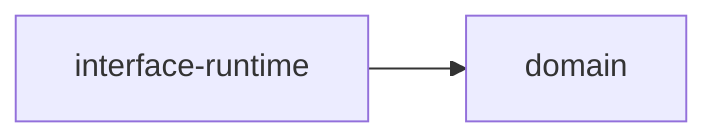

# 入口、装配与模块职责

[总览](README.md) · 下一篇：[契约与身份](02-contracts-and-identity.md)

## 装配产生覆盖真值

```mermaid
flowchart TB
    R["受控 route / merge / nest"] --> M["实际 Router"]<br/>    R --> I["实际 Endpoint Inventory"]<br/>    G["Effective Graph + activated factories + typed handlers"] --> S["冻结 Registry snapshot"]<br/>    I --> V["发布前交叉校验"]<br/>    S --> V<br/>    P["OpenAPI / descriptor / MCP methods"] --> V<br/>    V --> C["分类完整、Binding 唯一的可发布入口"]
```

实际挂载与 Inventory 从同一构造声明产生，不能以另一份手写清单证明路由覆盖。静态协议适配器保持静态；请求期间不能临时创建 Route 或拼装另一套执行计划。

```text
ActualEndpoints = Business ⊎ ProtocolControl ⊎ OperationalControl
Business Endpoint → exactly-one Binding → exactly-one Compiled Plan
```

这些是目标集合与互斥分类约束，不表示每个 Interface 只能有一个 Binding。未分类、重复来源、未知 Binding、无实际挂载和业务/控制分类冲突应在发布前拒绝。控制入口只能进入明确的有限分类，不能把业务入口改名为 control 来绕过 Kernel。

## 四个责任平面

| 平面 | 拥有的复杂度 | 不负责 |
| --- | --- | --- |
| Protocol Adapter | 协议解析、credential 接入、结果投影 | 绕过计划直接执行业务 |
| Canonical Interface | Definition/Binding/Plan、调用阶段与 Receipt | 业务事务、凭证解析、插件加载 |
| Business | 业务授权策略、不变量、状态流转和事务意图 | 解析 Cookie/SSE/MCP transport |
| Execution | SQL、存储、编排与窄 Runtime Port 的执行 | 重新定义业务权限或调用身份 |

`api-server` 是 Composition Root：把声明与具体实现装配到稳定 typed ports。Kernel 调用这些 ports，并不因此依赖具体 service、Storage、Plugin Framework 或 Runtime Host。



此图才表示该 crate 的内部直接依赖。完整 Cargo 边只维护在 [crate 职责表](../../../api/crates/AGENTS.md)；不能把业务调用箭头误读成允许新增依赖。

## 多协议与嵌套调用

HTTP/SSE/WebSocket、MCP/WebMCP 保持各自输入、错误和流式协议。WebMCP 外层管理自身调用生命周期，下游业务 Invocation 通过 lineage 关联；下游已收尾不能证明外层也已收尾。

Runtime Worker 是 Dispatch 后的执行目标；Background Worker/Schedule 是主动调用入口，两者不同。内部入口全集、System Principal、durable retry/ack 必须由其 owner 明确，不能由统一逻辑图推导为已全部接入。

## 源码入口

- [external_route_assembly.rs](../../../api/apps/api-server/src/external_route_assembly.rs)：挂载与 Inventory 同源构造。
- [external_endpoint_catalog.rs](../../../api/apps/api-server/src/external_endpoint_catalog.rs)：覆盖分类与发布校验。
- [WebMCP interface](../../../api/apps/api-server/src/routes/webmcp/interface.rs)：外层调用接入。
