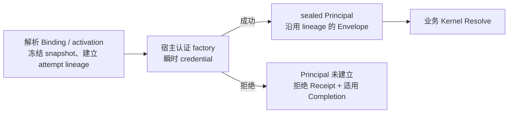

# 契约、认证与冻结身份

[总览](README.md) · 上一篇：[入口与职责](01-ingress-and-ownership.md) · 下一篇：[执行与扩展](03-execution-and-extensions.md)

## 六个对象回答六个问题

| 对象 | 回答的问题 |
| --- | --- |
| Interface Definition | 做什么：typed input/output/event/error、权限和执行模式 |
| Protocol Binding | 从哪里调用：协议入口如何对应业务契约 |
| Principal | 谁在调用：可信主体与授权上下文 |
| Compiled Plan | 本次采用哪些认证、授权、准入、Hook 和 Handler |
| Attempt | 由哪个目标、运行代次执行 |
| Receipt | 实际经历哪些阶段、观察和终态 |

Definition 不拥有 HTTP Header、数据库事务或 Runtime Worker。Binding 不拥有业务规则；一次调用按明确 binding_id 和 protocol 解析唯一计划，不能任取某 Interface 的第一条 Binding。

## 认证在适配器终止凭证传播



PublicPrincipal 不伪造 Actor；UserPrincipal/ApplicationPrincipal 内的 ActorContext 是授权真值。Application 同时携带契约要求的 application、api_key、workspace 身份。Cookie、Bearer Token、Session secret 和 API Key 原文不进入 Kernel、Handler、Receipt 或普通插件。

已解析入口的认证 attempt 在凭证验证前建立关联身份。拒绝记录包含安全的错误分类、阶段/时间和冻结身份，并发布到宿主观察渠道；不能只构造后丢弃。未认证不伪装为 Public 或空 Actor。

无法解析 Binding/activation、协议语法错误和认证 bootstrap 属于入口诊断边界，不捏造已解析业务计划。已有委托/WebSocket身份复用遵循原契约，不跳过应有委托裁决；不同消息仍有各自 Invocation identity。

## 同一 HTTP carrier 的受限变体

Compact 的 unary 执行可以投影为 SSE；有效工具回调则可能继续原 streaming resume。协议格式不能直接决定业务执行模式。

需要已认证上下文才能选择变体时，成功认证 attempt 只能在业务 Resolve 前被消费，并保持同一 snapshot、HTTP method/route、完整 authentication activation/adapter/policy、Principal profile 和 input contract。输出或执行模式可按已注册变体不同，但后续必须执行所选完整计划。

未知 Binding、其他入口或认证配置不匹配时拒绝；不重复认证、不重读当前可变 Registry、不回退为丢失 lineage 的 Envelope。认证失败仍使用入口候选计划记录拒绝。进入业务 Resolve 后不再切换 Binding/Plan。

## 两次冻结

```text
Resolve-time：Interface / Binding / Graph / Registry / Plan
Dispatch-time：Attempt / Handler / Target / Artifact / Runtime / Worker generation
```

在途调用保留旧快照，不混入新版本策略或实现。已 Dispatch 的 target/generation 不可覆盖；retry 使用新的 Attempt identity 与递增 ordinal。这是身份约束，不表示 Kernel 已实现 durable retry 调度或全历史聚合。

源码：[authentication.rs](../../../api/crates/interface-runtime/src/authentication.rs)；[公共类型入口](../../../api/crates/interface-runtime/src/lib.rs)。
