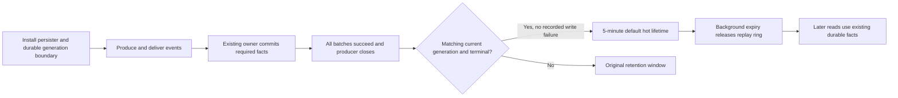

# Runtime replay retention and cold recovery

[中文](README.md)

## Ownership

Protocol mapping consumes AI Native facts. AI Native owns runs, callbacks, persistence and delivery. Provider plugins retain provider responsibilities. Eviction never reruns a completed provider request or tool.

| Data | Authority and reads | Memory lifetime |
| --- | --- | --- |
| Original frames, runtime events, completed output items, context versions, tool deliveries and ACKs | Existing PostgreSQL / original-payload storage; read by key, version lineage or event cursor when needed | No new full-history ephemeral copy |
| Frozen published orchestration plans | `PublishedPlanCache`, keyed by the run's actual `compiled_plan_id`; misses read the database | Reuses the approximately 5-minute `storage-ephemeral` cache |
| Current stream and recent replay | `LocalRuntimeEventStream` | Active and pending delivery data remain available; proven durable closed generations stay hot for 5 minutes by default |
| Replay boundary | One `runtime_stream_opened` row per new generation in existing `runtime_events`, containing only the generation UUID | Local state retains a scalar boundary and closure proof |

A generation is one stream lifetime for a `run_id`. A callback may reopen the run and reset its local sequence; database sequences remain monotonic. The two cursor domains are separate. New diagnostic batches carry their generation identity so delayed writes from a previous round cannot enter the next round's replay.

## Writes and eviction

Required business facts remain synchronous under their existing transaction / commit owners. The diagnostic persister retains its 64 KiB / 20 ms microbatch. Ineligible events and token deltas are filtered before batching; terminal events still flush preceding eligible facts. Original trajectory archive queues, receipts and backpressure retain their existing ownership.

The required provider forwarding owner awaits existing generation-aware writes for eligible small observations, such as usage snapshots, before forwarding completes. Their live copies do not enter the async batch again. This prevents a terminal transaction from sealing the run before its final observations commit. Callers using the async diagnostic lane must drain eligible batches before committing the business terminal; the 20 ms timer does not establish that ordering. A failed write preserves the original error and excludes that generation from early GC.

Short retention requires a generation-bound writer, immutable durable boundary, matching committed terminal, matching producer closure sequence and no recorded persistence failure. EOF alone, a terminal from a previous generation or a later successful write cannot substitute for these conditions. Failure is sticky within a generation.

A background timer performs memory eviction; users do not need a database cleanup job. Repeated confirmation does not extend the hot lifetime. Unproven streams retain the original windows: 2 hours for ordinary closed runs, 24 hours for callback / human waits, and 72 hours from the last event for unclosed orphan streams. Independent subscriber references retain pending backlog. Dropping a receiver ends idle forwarding. A pinned old writer retains only scalar terminal authority after eviction; it cannot pin the retired ring or close a reopened stream.

## Cold reads

Compatible protocols, Native SSE and Debug SSE / WebSocket recover from existing facts. Reads freeze the database high watermark and use keyset pagination: 64 rows per compatible / Native page and 1000 per Debug page. Hot gap backfill also uses 64-event pages. Initial hot subscriptions may still materialize their replay; this change does not bound every temporary allocation.

Compatible recovery assembles the necessary output prefix for one response round and orders complete items by `output_index`. Tool delivery retains the existing claim / ACK owner; ACKed calls are not delivered again. Execution reads context lineage only when needed. Version-addressed checkpoints omit redundant legacy snapshot reads; legacy locators retain the complete original snapshot.

Cold recovery preserves the semantics of recorded complete content. Original token boundaries and timing cannot be reconstructed when never stored. Legacy runs without generation anchors use the existing terminal snapshot. Active cursor gaps are not projected as completed history: Debug reports `unresolved_live_gap`. Upstream error objects and extension fields retain their original protocol projection.

## Configuration and tradeoffs

| Environment variable | Default | Meaning |
| --- | --- | --- |
| `API_RUNTIME_REPLAY_HOT_TTL_SECONDS` | `300` | Hot lifetime for confirmed closed replay; `0` permits immediate cold recovery |
| `API_RUNTIME_REPLAY_RECOVERABLE_MAX_BYTES` | Unset | Optional operator replay-cache byte budget; evicts only confirmed closed entries without restricting session or concurrency admission |

Invalid values warn and retain defaults. The budget excludes active and unconfirmed runs and is not a process-wide memory cap.

Steady-state confirmed closed replay is approximately `M_hot ≈ λ × E[B] × T_hot`, where λ is the generation closure rate, B is retained bytes per generation and T_hot is the hot lifetime. Total memory also includes active work, unconfirmed replay, subscriber backlog and allocator state. Use this model for matched-workload comparisons, not a fixed RSS promise.

The costs are one small boundary row per generation, proof queries and paged I/O on cold misses. The change does not duplicate entire conversations or introduce a new body table. Cold misses may add tail latency; failed writes retain longer replay to protect recovery.

Eligible provider observations add database wait time to their forwarding path; token deltas do not acquire synchronous writes. Existing fact rows are reused without duplicate async writes or early eviction of uncommitted facts.

Hot GC neither deletes database history nor extends its existing retention policy. Durable deletion belongs to existing data-retention / user-deletion policies. Deleted facts cannot be recovered from an expired cache, and tools must not be rerun to fill that loss. Releasing Rust objects does not immediately reduce RSS: jemalloc slab slots can remain reusable, and metadata or partially occupied pages may remain resident. Acceptance reports ring bytes / capacity separately from actual RSS / PSS evidence.
