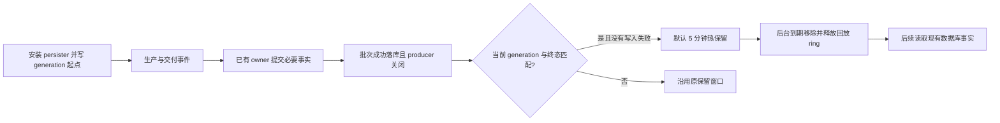

# Runtime 热回放与冷恢复

[English](README.en.md)

## 数据归属

映射协议层消费 AI Native 事实；AI Native 管理运行、回调、持久化和交付；供应商插件保留供应商职责。回放回收不会重执行已完成的供应商请求或工具。

| 数据 | 真值与读取 | 内存生命周期 |
| --- | --- | --- |
| 原始帧、运行事件、完成的输出 item、上下文版本、工具交付与 ACK | 现有 PostgreSQL / 原始正文存储；需要时按主键、版本链或事件游标读取 | 不新增全历史 ephemeral 副本 |
| 已发布的冻结编排计划 | `PublishedPlanCache`，键为运行实际引用的 `compiled_plan_id`；miss 查库 | 复用 `storage-ephemeral` 的约 5 分钟缓存 |
| 当前流与近期回放 | `LocalRuntimeEventStream` | 活跃与待交付数据保留；已证明落库的关闭 generation 默认热保留 5 分钟 |
| 回放起点 | 现有 `runtime_events` 每个新 generation 一条 `runtime_stream_opened`，正文仅含 generation UUID | 本地只持有标量起点和关闭证明 |

generation 表示同一 `run_id` 的一次流生命周期。回调重开可重置本地序号，数据库序号仍单调增加；二者不能互相代用。新事件批次附带 generation 身份，防止上一轮延迟写入混入下一轮。

## 写入与回收

必要业务事实仍由现有事务 / commit owner 同步写入。诊断 persister 沿用 64 KiB / 20 ms 微批；无须持久化的事件和 token delta 在入批前过滤，终态仍刷新前面的有效事件。原始轨迹归档的队列、回执和背压保持原有职责。

供应商转发 owner 对需要落库的用量等小型观察事实，在转发结束前等待现有 generation-aware 写入完成；流副本不再重复入异步批次。这样数据库终态不会抢先封闭运行，导致最后一批事实写入失败。异步诊断调用方仍需在业务终态提交前排空其有效批次；20 ms 定时器不提供这项顺序保证。写失败保留原始错误并禁止该 generation 提前 GC。

短回收的必要条件是：generation-bound writer、不可变 durable 起点、该 generation 的匹配终态已落库、producer 的关闭序号一致、没有已记录的写入失败。单独 EOF、旧轮次终态或后续写入成功都不能代替这些条件。失败标记在本轮内不可清除。

后台计时器触发内存淘汰；不需要用户配置数据库定时任务。重复确认不会延长热期。未证明可恢复的关闭流仍保留原窗口：普通关闭 2 小时、等待回调 / 人工 24 小时、未关闭孤儿流最后事件起 72 小时。未交付的订阅者 backlog 由独立引用保留；接收者销毁会结束空闲转发。旧 writer 即使仍存活也只保留终态标量，不能继续钉住已淘汰 ring，也不能关闭重开的流。

## 冷读

兼容协议、Native SSE 和 Debug SSE / WebSocket 共用现有事实恢复。读取冻结数据库上界，使用 keyset 分页；兼容 / Native 每页 64 条，Debug 每页 1000 条。本地热流 gap 回填也按 64 条分页。初始热订阅仍可能持有该订阅的完整 replay，不能据此宣称所有临时内存恒定。

兼容恢复只组装一个响应轮次的必要输出前缀，并按 `output_index` 排列完整 item。工具交付继续走既有 claim / ACK owner；已 ACK 的调用不重新交付。上下文仅在执行确实需要时读取版本链；有版本定位的 checkpoint 不再加载重复的 legacy snapshot，旧定位仍读取原快照。

冷恢复提供已记录完整内容的语义回放。未记录的原始 token 分片和时序无法重建；旧历史无 generation 起点时使用现有终态快照。活跃流的游标缺口不冒充完成历史，Debug 会报告 `unresolved_live_gap`。上游错误对象和扩展字段继续使用原协议投影。

## 供应商连接恢复

数据库冷恢复与供应商连接恢复有不同 owner：AI Native 从现有事实恢复运行和回调；OpenAI 插件使用同一属主、同一配置的完整原始完成历史恢复供应商请求。合法字符串输入也进入完成历史，原生 wire 转换保持原样。

OpenAI 0.2.72 在旧连接不可用时，可移除旧游标并进行一次完整上下文 WebSocket 重建；重建请求在语义输出前发生可恢复传输失败时，auto 模式可在原预算和 deadline 内，将实际重建正文交给 SSE。既有 `OneFullContextRebuild + ProviderHttp` 回执表示插件已发送完整 scoped native 上下文；宿主校验尝试、epoch、commit、游标归属和传输结果。

该恢复契约从宿主 0.5.4 开始支持；OpenAI 0.2.72 的 `minimum_host_version` 为 0.5.4，官方安装和更新通过既有语义版本准入拒绝旧宿主。部署须使用已验证的宿主 / 插件配对版本。兼容性强制覆盖和直接加载绕过该默认保护，不属于支持范围。

仅有旧游标和新增工具输出、游标为空、或状态机选择过重建，均不能证明正文完整。显式 ConnectionBound、历史缺失 / 属主不符、协议 / 认证 / 策略错误、已提交语义结果和 force_websocket 均禁止这条降级。已完成工具不重执行；重建正文仅属于当前调用，不新增全历史缓存或正文表。

## 配置、收益与成本

| 环境变量 | 默认 | 作用 |
| --- | --- | --- |
| `API_RUNTIME_REPLAY_HOT_TTL_SECONDS` | `300` | 已确认关闭回放的热寿命；`0` 允许立即转冷 |
| `API_RUNTIME_REPLAY_RECOVERABLE_MAX_BYTES` | 未设置 | 运维可选的回放缓存字节预算；只淘汰已确认关闭项，不限制会话或并发准入 |

非法配置告警并保留默认值。预算不约束活跃或未确认运行，因此不是整个进程的内存上限。

稳态的已确认关闭回放可近似为 `M_hot ≈ λ × E[B] × T_hot`，其中 λ 是关闭 generation 速率，B 是本轮回放保留字节，T_hot 是热期。总内存还包含活跃请求、未确认回放、订阅 backlog 和分配器。此式用于同负载比较，不承诺固定 RSS。

成本是每轮一个小型起点行、确认查询及冷 miss 时的分页 I/O；不重复保存整段会话历史，也不引入新正文表。冷读取可能增加尾延迟；失败时保留较长回放以保护恢复能力。

供应商观察写入会增加这类事实的数据库等待时间，但 token delta 不增加同步写入。它复用已有事实行，避免异步重复写入，也不让未提交的事实被短期回收。

热 GC 不删除数据库历史，也不延长其既有保留策略。删除持久化事实应由现有数据保留 / 用户删除策略管理；已删除事实无法凭缓存恢复，不能通过重执行工具弥补。Rust 对象释放不等于 RSS 立即下降：jemalloc slab 空槽可复用，元数据及部分页可能继续驻留。验收分别报告 ring 字节 / capacity 的释放与实际 RSS / PSS 证据。
