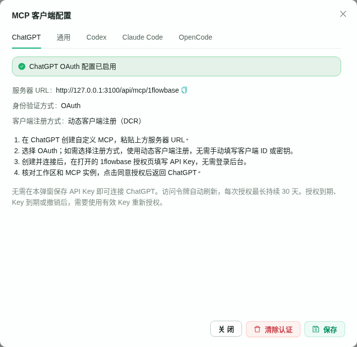
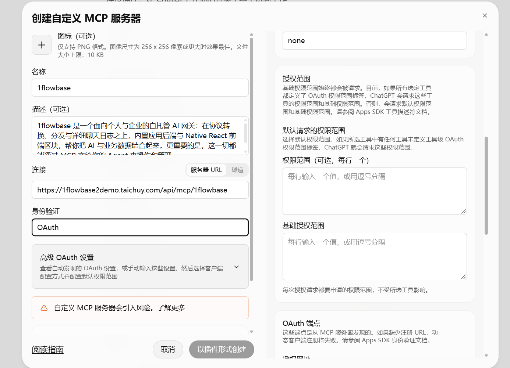
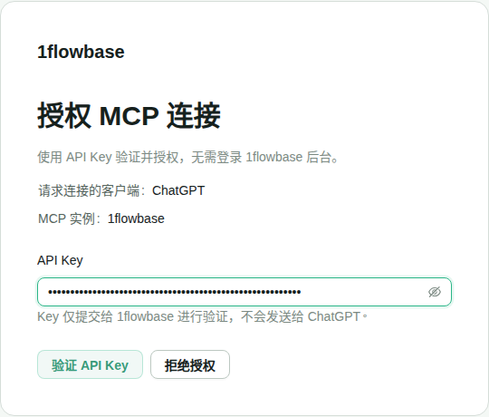
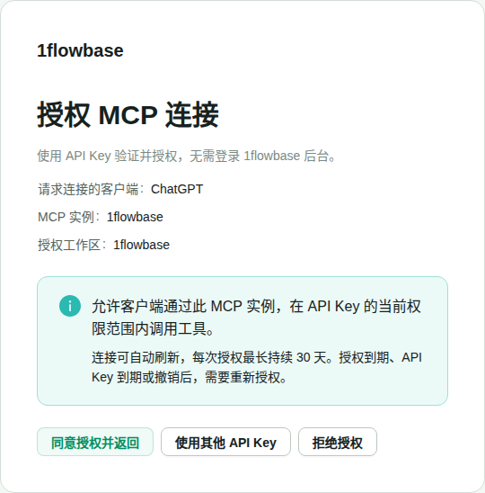

# 把 1flowbase 连接到 ChatGPT：自动发现 → API Key 授权

在 ChatGPT 填写 MCP 服务器地址、选择 OAuth。ChatGPT 自动读取认证配置；连接时打开 **1flowbase 的授权页面**。你在该页面填写自己的 **1flowbase 用户 API Key**，确认授权后返回 ChatGPT。

```text
ChatGPT：填写服务器 URL，选择 OAuth
                    ↓
ChatGPT：自动发现认证端点，动态注册客户端
                    ↓
1flowbase 授权页：填写 API Key → 验证 → 确认授权
                    ↓
ChatGPT：完成连接，调用你有权限使用的工具
```

API Key 不填在 ChatGPT 的客户端 ID 或客户端密钥里，也不放进服务器 URL。它只提交给 1flowbase；ChatGPT 获得单独的访问令牌和刷新令牌。

> 更新后的服务默认提供 OAuth 自动发现，无需新增环境变量。连接前确认自动发现地址可以访问；部署检查方法见文末。

## 第一步：复制 MCP 服务器 URL

在 1flowbase 打开 **设置 → MCP → 连接客户端 → ChatGPT**。

- 显示 **OAuth 配置已启用**：复制服务器 URL。
- 显示 **此部署尚未启用 ChatGPT 授权**：通常是旧版服务，先更新 API 与前端，见文末。



上图是本地实测界面，`127.0.0.1` 仅用于展示。ChatGPT 实际连接要使用你公开 HTTPS 部署的 URL。

地址格式为 `https://你的域名/api/mcp/你的实例ID`。例如：

```text
https://1flowbase2demo.taichuy.com/api/mcp/1flowbase
```

以弹窗实际复制的地址为准。准备一个有效的用户 API Key；该 Key 所属的工作区应包含要连接的 MCP 实例。

## 第二步：在 ChatGPT 创建自定义 MCP 服务器

打开 **创建自定义 MCP 服务器** 界面，按下面填写。入口名称可能随 ChatGPT 版本变化。

| 界面字段 | 怎么填 |
| --- | --- |
| 名称 | 例如 `1flowbase` |
| 图标、描述 | 可选，不影响认证 |
| 连接 | 选择服务器 URL，粘贴第一步复制的完整地址 |
| 身份验证 | 选择 **OAuth** |



展开 **高级 OAuth 设置**，核对下面这些项：

| 高级设置字段 | 怎么选或填写 |
| --- | --- |
| 客户端配置方式／注册方式 | 选择 **动态客户端注册（DCR）**；当前 1flowbase 不支持 CIMD |
| OAuth 客户端 ID、客户端密钥 | 使用 DCR，无需手动填写；不要填用户 API Key |
| 令牌端点身份验证方式（如有） | `none`；表示客户端不使用密钥交换令牌，用户仍需授权 |
| 默认请求的权限范围 | 如需填写，填 `mcp:invoke`，不要填 `openid`、`email` 或 `profile` |
| 基础授权范围 | 留空 |
| OAuth 端点 | 由 ChatGPT 自动发现，无需逐项手填 |

如果端点为空或自动发现失败，先检查文末的服务版本和代理路由。手工填写端点不能修复部署路由。若端点已发现但创建按钮仍不可用，检查界面是否还有未完成的必填项或错误提示。

点击 **以插件形式创建**（或当前界面的创建按钮），再按 ChatGPT 提示连接、授权。创建配置和用户授权可能分成两个步骤；仅创建成功不代表已经授权。

## 第三步：在 1flowbase 授权页填写 API Key

连接过程中，ChatGPT 应打开 1flowbase 的授权页面。

1. 确认页面域名是你连接的 1flowbase 域名。
2. 在 **API Key** 输入框填写自己的 1flowbase 用户 API Key。
3. 点击 **验证 API Key / Verify API key**。



无需输入管理后台账号密码，也无需在「MCP 客户端配置」弹窗保存 Key。

如果页面提示请求无效或已过期，返回 ChatGPT 重新发起连接。不要手工打开一个没有授权请求参数的 `/mcp/authorize` 地址。

## 第四步：核对工作区和实例，确认授权

验证成功后，页面会清空 Key 输入，并显示：

| 页面信息 | 核对内容 |
| --- | --- |
| 请求连接的客户端 / Requesting client | ChatGPT |
| MCP 实例 / MCP instance | 你要连接的实例 |
| 授权工作区 / Authorized workspace | 该 Key 对应的工作区 |



确认无误后，点击 **同意授权并返回 / Authorize and return**。

工作区不对时，点击 **使用其他 API Key / Use another API key** 重新验证；不想连接则点击拒绝授权。

## 第五步：返回 ChatGPT 验证连接

回到 ChatGPT 后，确认连接状态，并调用一个你有权限使用的工具。

完成标志是 **授权成功回跳，且工具调用成功**。仅验证 API Key，或者只看到插件创建成功，都不算连接完成。

## 连不上时，先看这里

| 现象 | 下一步 |
| --- | --- |
| 1flowbase 显示「此部署尚未启用 ChatGPT 授权」 | 管理员检查服务版本和部署状态，见下面部署检查 |
| ChatGPT 发现不到 OAuth 端点 | 检查 `/.well-known/oauth-*` 是否返回 JSON；404 时检查代理路由 |
| 元数据或 MCP 请求返回 Cloudflare 挑战 / 403 | 调整必要机器请求的 WAF 策略，保留 MCP 鉴权 |
| 出现手填客户端 ID／密钥的要求 | 核对是否选择 DCR，而不是手动配置客户端 |
| 授权页没有打开 | 确认创建后是否还需要点击连接或授权；检查 ChatGPT 错误提示 |
| API Key 验证失败 | 检查 Key 是否有效、用户是否启用、工作区与实例是否匹配 |
| 授权页提示请求无效或过期 | 返回 ChatGPT 重新连接 |
| 原 Key 被撤销、到期或权限变化后调用失败 | 使用当前权限下的有效 Key 重新授权 |
| 授权约 30 天后失效 | 重新连接并授权；自动刷新不会延长授权总期限 |

## 部署管理员：部署检查

### 1. 更新服务

部署包含本次默认启用调整的 API、前端和正式数据库迁移。**无需配置 OAuth 环境变量，也无需手动设置公开地址。**

生产使用 HTTPS，Web、API 和授权页使用同一个公开网站地址。服务根据当前请求的网站域名生成认证地址；从哪个域名连接，就在该域名完成授权与令牌调用。公开地址改变后，应在 ChatGPT 重新建立连接。

### 2. 核对反向代理路由

Web、API 和授权页使用同一个公开网站地址：

| 路径 | 转发目标 |
| --- | --- |
| `/api/` | API 服务 |
| `/.well-known/oauth-*` | API 服务，不能返回前端 HTML |
| `/mcp/authorize` | Web 前端 |

仓库 Nginx 和 Vite 配置已包含对应路由，并保留外部访问的 `Host`。自建反向代理和旧版线上配置也需要同步；HTTPS 代理应覆盖 `X-Forwarded-Proto` 为正确的外部协议，不能把内部 API 主机名传成公开域名。Cloudflare/WAF 不能要求 ChatGPT 的元数据、注册、令牌及 MCP 机器请求完成浏览器挑战。

### 3. 在浏览器检查是否真的启用

将下面地址中的域名和实例 ID 换成实际值：

```text
https://你的域名/api/public/mcp-oauth/config?instance_id=你的实例ID
```

应返回 `enabled: true`，并包含正确的 `server_url`。旧版服务返回 `enabled: false` 时，先更新服务；新版若返回错误，检查代理是否保留正确的域名与 HTTPS 协议。

再打开：

```text
https://你的域名/.well-known/oauth-authorization-server
https://你的域名/.well-known/oauth-protected-resource/api/mcp/你的实例ID
```

两者都应返回 JSON。授权服务器元数据应包含正确的 HTTPS 地址：

| 字段 | 当前实现的路径 |
| --- | --- |
| `authorization_endpoint` | `/api/public/mcp-oauth/authorize` |
| `token_endpoint` | `/api/public/mcp-oauth/token` |
| `registration_endpoint` | `/api/public/mcp-oauth/register` |

这些是排障时核对的字段，不是要求普通用户在 ChatGPT 手工填写的配置。

## 授权有效期和权限

- OAuth 令牌只用于指定 MCP 实例和 Key 的工作区，不能用于登录管理后台或访问其他实例。
- 后端每次使用令牌都重新校验原 Key、用户与角色权限；工具调用仍遵循业务权限。
- 后台网页登录会话过期，不影响已建立的 MCP OAuth 授权。
- 访问令牌最长有效 1 小时，ChatGPT 可使用刷新令牌续期；每次授权最长持续 30 天。
- 原 Key 更早到期、被撤销或用户被禁用时，连接也会提前失效。刷新令牌轮换，重复使用旧刷新令牌会使关联授权失效。

## 实现依据与验证范围

当前协议采用授权码 + PKCE S256 与动态客户端注册（DCR）。注册只接受支持的 ChatGPT HTTPS 回调，不支持 CIMD 外部元数据获取。授权码和刷新令牌由数据库原子消费，持久化的是令牌 hash 与关联数据，不是 API Key 原文。

本教程参考当前 1flowbase 的授权流程、OpenAI 官方认证文档，以及本地 AgentDock 的自动发现、动态客户端注册和授权页面实现。

教程中的 1flowbase 截图来自本次本地真实 API 与浏览器操作；使用临时 API Key 授权，完成后撤销。ChatGPT 创建界面的图片为用户提供的实际截图。

本地协议验证使用测试客户端，不能代替真人 ChatGPT 账号的创建、授权回跳和工具调用验证。线上仍需部署更新后的服务及代理配置，再按第五步验证连接。

源码与更新：[仓库接入说明](https://github.com/taichuy/1flowbase/blob/dev/docs/integrations/chatgpt-mcp.md)。

参考：[OpenAI MCP 认证要求](https://developers.openai.com/apps-sdk/build/auth/)；[1flowbase 实现与验收记录](https://github.com/taichuy/1flowbase/issues/2249)。
